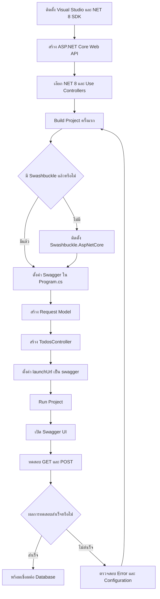

# คู่มือเริ่มต้น Setup TodoListAPI และติดตั้ง Swagger

## ASP.NET Core Web API ด้วย .NET 8

**ประเภทเอกสาร:** คู่มือ Setup Project และ Workshop  
**Project:** TodoListAPI  
**Framework:** .NET 8  
**API Documentation:** Swagger / OpenAPI  
**วันที่จัดทำ:** 5 สิงหาคม 2026

---

## สารบัญ

1. [วัตถุประสงค์](#1-วัตถุประสงค์)
2. [Software ที่ต้องเตรียม](#2-software-ที่ต้องเตรียม)
3. [ตาราง Flow ขั้นตอน](#3-ตาราง-flow-ขั้นตอน)
4. [ตรวจสอบ NET SDK](#4-ตรวจสอบ-net-sdk)
5. [ติดตั้ง Visual Studio Workload](#5-ติดตั้ง-visual-studio-workload)
6. [สร้าง TodoListAPI Project](#6-สร้าง-todolistapi-project)
7. [ตรวจสอบโครงสร้าง Project](#7-ตรวจสอบโครงสร้าง-project)
8. [ติดตั้ง Swagger](#8-ติดตั้ง-swagger)
9. [ตั้งค่า Programcs](#9-ตั้งค่า-programcs)
10. [สร้าง Request Model](#10-สร้าง-request-model)
11. [สร้าง TodosController](#11-สร้าง-todoscontroller)
12. [ตั้งค่า launchSettingsjson](#12-ตั้งค่า-launchsettingsjson)
13. [Build และ Run Project](#13-build-และ-run-project)
14. [ทดสอบ API ด้วย Swagger](#14-ทดสอบ-api-ด้วย-swagger)
15. [ตัวอย่าง HTTP Request](#15-ตัวอย่าง-http-request)
16. [ข้อผิดพลาดที่พบบ่อย](#16-ข้อผิดพลาดที่พบบ่อย)
17. [Setup Checklist](#17-setup-checklist)
18. [สรุป](#18-สรุป)

---

# 1. วัตถุประสงค์

คู่มือนี้อธิบายขั้นตอนเริ่มต้นสร้าง ASP.NET Core Web API และติดตั้ง Swagger โดยยังไม่เชื่อมต่อฐานข้อมูล เพื่อให้ผู้เรียนเข้าใจโครงสร้างและทดสอบ API ได้ก่อน

หลังจบคู่มือ ผู้เรียนจะสามารถ:

- สร้าง ASP.NET Core Web API Project ด้วย .NET 8
- ใช้ Controller-based API
- ติดตั้ง `Swashbuckle.AspNetCore`
- ตั้งค่า Swagger Generator และ Swagger UI
- สร้าง GET และ POST Endpoint
- Build, Run และ Debug Project
- ทดสอบ API ผ่าน Swagger UI
- ตรวจสอบ Swagger JSON

---

# 2. Software ที่ต้องเตรียม

| ลำดับ | Software | วัตถุประสงค์ |
|---:|---|---|
| 1 | Visual Studio 2022 | สร้าง แก้ไข Run และ Debug Project |
| 2 | .NET 8 SDK | Compile และ Run ASP.NET Core Application |
| 3 | Web Browser | เปิด Swagger UI |
| 4 | Postman | ทดสอบ API เพิ่มเติม |
| 5 | Git | จัดเก็บและควบคุม Source Code |

Visual Studio ต้องติดตั้ง Workload:

```text
ASP.NET and web development
```

---

# 3. ตาราง Flow ขั้นตอน

| Step | ขั้นตอน | การดำเนินการ | ผลลัพธ์ที่คาดหวัง |
|---:|---|---|---|
| 1 | เตรียมเครื่องมือ | ติดตั้ง Visual Studio 2022 และ .NET 8 SDK | เครื่องพร้อมพัฒนา Web API |
| 2 | ตรวจสอบ SDK | รันคำสั่งตรวจสอบ .NET Version | พบเวอร์ชัน 8.0.x |
| 3 | สร้าง Project | เลือก ASP.NET Core Web API | ได้ Solution และ Project |
| 4 | ตั้งค่า Project | เลือก .NET 8, HTTPS, Controllers และ OpenAPI | Project ถูกสร้างตามรูปแบบที่กำหนด |
| 5 | Build ครั้งแรก | Build Solution | แสดง Build succeeded |
| 6 | ตรวจสอบ Swagger | ตรวจสอบ NuGet Package | พบ Swashbuckle.AspNetCore |
| 7 | ติดตั้ง Swagger | ติดตั้ง Package หากยังไม่มี | Package ถูกเพิ่มใน Project |
| 8 | ตั้งค่า Services | เพิ่ม Swagger Generator ใน Program.cs | Application สร้าง OpenAPI Document ได้ |
| 9 | ตั้งค่า Middleware | เปิด Swagger และ Swagger UI | เปิดหน้า Swagger ได้ |
| 10 | สร้าง Model | สร้าง Request Model สำหรับรับ JSON | POST Endpoint รับข้อมูลได้ |
| 11 | สร้าง Controller | เพิ่ม GET, GET by ID และ POST | Swagger แสดง Endpoint |
| 12 | ตั้งค่า Launch | กำหนด launchUrl เป็น swagger | Run แล้วเปิด Swagger อัตโนมัติ |
| 13 | Run Project | กด F5 หรือ Ctrl+F5 | API เริ่มทำงาน |
| 14 | ทดสอบ API | ใช้ Try it out และ Execute | ได้ HTTP 200 หรือ 201 |
| 15 | ตรวจสอบผล | ตรวจสอบ Response และ Swagger JSON | API พร้อมพัฒนาต่อ |

## Flow Diagram



---

# 4. ตรวจสอบ NET SDK

เปิด Command Prompt, PowerShell หรือ Terminal แล้วรัน:

```bash
dotnet --version
```

ผลลัพธ์ควรเป็นเวอร์ชัน `8.0.x` ตัวอย่าง:

```text
8.0.419
```

ตรวจสอบ SDK ทั้งหมดในเครื่อง:

```bash
dotnet --list-sdks
```

ตัวอย่างผลลัพธ์:

```text
8.0.419 [C:\Program Files\dotnet\sdk]
```

หากไม่พบคำสั่ง `dotnet` หรือไม่พบ .NET 8 ให้ติดตั้ง .NET 8 SDK ก่อนดำเนินการต่อ

---

# 5. ติดตั้ง Visual Studio Workload

1. เปิด `Visual Studio Installer`
2. เลือก Visual Studio 2022
3. กด `Modify`
4. เลือก Workload `ASP.NET and web development`
5. กด `Modify`
6. รอจนติดตั้งเสร็จ

---

# 6. สร้าง TodoListAPI Project

## 6.1 เลือก Project Template

เปิด Visual Studio 2022 แล้วเลือก:

```text
Create a new project
```

ค้นหาและเลือก:

```text
ASP.NET Core Web API
```

กด `Next`

## 6.2 กำหนดชื่อ Project

```text
Project name  : TodoListAPI
Location      : D:\Training\TodoListAPI
Solution name : TodoListAPI
```

กด `Next`

## 6.3 กำหนด Additional Information

```text
Framework              : .NET 8.0
Authentication type    : None
Configure for HTTPS    : Checked
Enable container       : Unchecked
Enable OpenAPI support : Checked
Use controllers        : Checked
```

กด `Create`

## 6.4 ตัวอย่างสร้าง Project ผ่าน .NET CLI

หากต้องการสร้างจาก Command Line:

```bash
dotnet new webapi --use-controllers -n TodoListAPI -f net8.0
cd TodoListAPI
```

Build Project:

```bash
dotnet build
```

---

# 7. ตรวจสอบโครงสร้าง Project

โครงสร้างเริ่มต้น:

```text
TodoListAPI
│
├── Controllers
│   └── WeatherForecastController.cs
│
├── Models
│
├── Properties
│   └── launchSettings.json
│
├── appsettings.json
├── appsettings.Development.json
├── Program.cs
└── TodoListAPI.csproj
```

## หน้าที่ของส่วนสำคัญ

| ส่วน | หน้าที่ |
|---|---|
| Controllers | รับ HTTP Request และส่ง HTTP Response |
| Models | เก็บรูปแบบข้อมูล Entity หรือ Request Model |
| Program.cs | ลงทะเบียน Services และกำหนด Middleware Pipeline |
| appsettings.json | เก็บ Configuration ของ Application |
| launchSettings.json | กำหนด URL, Port, Environment และหน้าเริ่มต้น |
| TodoListAPI.csproj | กำหนด Framework และ NuGet Package ของ Project |

## ลบไฟล์ตัวอย่าง

หากไม่ต้องการใช้ Weather Forecast ให้ลบ:

```text
WeatherForecast.cs
Controllers/WeatherForecastController.cs
```

---

# 8. ติดตั้ง Swagger

สำหรับ .NET 8 สามารถใช้ Package:

```text
Swashbuckle.AspNetCore
```

## 8.1 ตรวจสอบ Package

ไปที่:

```text
Solution Explorer
> TodoListAPI
> Dependencies
> Packages
```

ตรวจสอบว่ามี:

```text
Swashbuckle.AspNetCore
```

## 8.2 ติดตั้งผ่าน Package Manager Console

เปิด:

```text
Tools
> NuGet Package Manager
> Package Manager Console
```

รัน:

```powershell
Install-Package Swashbuckle.AspNetCore -Version 6.6.2
```

## 8.3 ติดตั้งผ่าน .NET CLI

เปิด Terminal ที่ Folder ซึ่งมีไฟล์ `.csproj`:

```bash
dotnet add package Swashbuckle.AspNetCore --version 6.6.2
dotnet restore
dotnet build
```

## 8.4 ตัวอย่าง TodoListAPI.csproj

```xml
<Project Sdk="Microsoft.NET.Sdk.Web">

  <PropertyGroup>
    <TargetFramework>net8.0</TargetFramework>
    <Nullable>enable</Nullable>
    <ImplicitUsings>enable</ImplicitUsings>
  </PropertyGroup>

  <ItemGroup>
    <PackageReference Include="Swashbuckle.AspNetCore"
                      Version="6.6.2" />
  </ItemGroup>

</Project>
```

> หากติดตั้งผ่าน NuGet แล้ว ไม่จำเป็นต้องแก้ `.csproj` ด้วยตนเอง

---

# 9. ตั้งค่า Programcs

เปิดไฟล์ `Program.cs` และใช้โค้ดต่อไปนี้:

```csharp
using Microsoft.EntityFrameworkCore;
using System.Diagnostics;

var builder = WebApplication.CreateBuilder(args);

// Add services to the Controllder.
builder.Services.AddControllers();

//Add Endpoint & SwaggerGen
builder.Services.AddEndpointsApiExplorer();
builder.Services.AddSwaggerGen();

var app = builder.Build();

// Configure the HTTP request pipeline.
if (app.Environment.IsDevelopment())
{   /* Usse SwaggerUI */
    app.UseSwagger();
    app.UseSwaggerUI();
}

app.UseHttpsRedirection();

app.UseAuthorization();

app.MapControllers();

app.Run();


```

## คำอธิบายคำสั่ง Swagger

| คำสั่ง | หน้าที่ |
|---|---|
| AddEndpointsApiExplorer | ลงทะเบียน API Endpoint Explorer |
| AddSwaggerGen | สร้าง OpenAPI Document จาก Controller และ Model |
| SwaggerDoc | กำหนดชื่อ Version และรายละเอียดเอกสาร API |
| UseSwagger | เปิด Endpoint สำหรับ Swagger JSON |
| UseSwaggerUI | เปิดหน้า Web UI สำหรับอ่านและทดสอบ API |
| SwaggerEndpoint | ระบุตำแหน่ง OpenAPI JSON ที่ Swagger UI ต้องโหลด |

---

# 10. สร้าง Request Model

สร้าง Folder:

```text
Models
```

สร้างไฟล์:

```text
Models/CreateTodoRequest.cs
```

ใส่โค้ด:

```csharp
using System.ComponentModel.DataAnnotations;

namespace TodoListAPI.Models;

public class CreateTodoRequest
{
    [Required(ErrorMessage = "กรุณาระบุชื่อ Todo")]
    [MaxLength(200, ErrorMessage = "ชื่อ Todo ต้องไม่เกิน 200 ตัวอักษร")]
    public string Title { get; set; } = string.Empty;

    [MaxLength(1000, ErrorMessage = "รายละเอียดต้องไม่เกิน 1,000 ตัวอักษร")]
    public string? Description { get; set; }

    public DateTime? DueDate { get; set; }
}
```

สร้างไฟล์สำหรับ Response:

```text
Models/TodoItem.cs
```

```csharp
namespace TodoListAPI.Models;

public class TodoItem
{
    public int Id { get; set; }

    public string Title { get; set; } = string.Empty;

    public string? Description { get; set; }

    public bool IsCompleted { get; set; }

    public DateTime? DueDate { get; set; }

    public DateTime CreatedDate { get; set; }
}
```

---

# 11. สร้าง TodosController

สร้างไฟล์:

```text
Controllers/TodosController.cs
```

ใส่โค้ด:

```csharp
using Microsoft.AspNetCore.Mvc;
using TodoListAPI.Models;

namespace TodoListAPI.Controllers;

[ApiController]
[Route("api/[controller]")]
public class TodosController : ControllerBase
{
    private static readonly List<TodoItem> Todos =
    [
        new TodoItem
        {
            Id = 1,
            Title = "Setup TodoListAPI",
            Description = "สร้าง ASP.NET Core Web API Project",
            IsCompleted = true,
            CreatedDate = DateTime.UtcNow
        },
        new TodoItem
        {
            Id = 2,
            Title = "Install Swagger",
            Description = "ติดตั้งและตั้งค่า Swashbuckle",
            IsCompleted = false,
            CreatedDate = DateTime.UtcNow
        }
    ];

    [HttpGet]
    [ProducesResponseType(typeof(IEnumerable<TodoItem>), StatusCodes.Status200OK)]
    public ActionResult<IEnumerable<TodoItem>> GetTodos()
    {
        return Ok(Todos);
    }

    [HttpGet("{id:int}")]
    [ProducesResponseType(typeof(TodoItem), StatusCodes.Status200OK)]
    [ProducesResponseType(StatusCodes.Status404NotFound)]
    public ActionResult<TodoItem> GetTodoById(int id)
    {
        var todo = Todos.FirstOrDefault(item => item.Id == id);

        if (todo is null)
        {
            return NotFound(new
            {
                message = $"ไม่พบ Todo ID {id}"
            });
        }

        return Ok(todo);
    }

    [HttpPost]
    [ProducesResponseType(typeof(TodoItem), StatusCodes.Status201Created)]
    [ProducesResponseType(StatusCodes.Status400BadRequest)]
    public ActionResult<TodoItem> CreateTodo(
        [FromBody] CreateTodoRequest request)
    {
        var nextId = Todos.Count == 0
            ? 1
            : Todos.Max(item => item.Id) + 1;

        var todo = new TodoItem
        {
            Id = nextId,
            Title = request.Title.Trim(),
            Description = request.Description?.Trim(),
            DueDate = request.DueDate,
            IsCompleted = false,
            CreatedDate = DateTime.UtcNow
        };

        Todos.Add(todo);

        return CreatedAtAction(
            nameof(GetTodoById),
            new { id = todo.Id },
            todo);
    }
}
```

> ตัวอย่างนี้เก็บข้อมูลในหน่วยความจำ ข้อมูลจะหายเมื่อหยุด Application เหมาะสำหรับทดสอบ Swagger ก่อนเชื่อมต่อ SQL Server

## Endpoint ที่ได้

| Method | Endpoint | รายละเอียด | Success Status |
|---|---|---|---|
| GET | `/api/Todos` | อ่าน Todo ทั้งหมด | 200 OK |
| GET | `/api/Todos/{id}` | อ่าน Todo ตาม ID | 200 OK |
| POST | `/api/Todos` | เพิ่ม Todo ใหม่ | 201 Created |

---

# 12. ตั้งค่า launchSettingsjson

เปิดไฟล์:

```text
Properties/launchSettings.json
```

ตัวอย่าง:

```json
{
  "$schema": "http://json.schemastore.org/launchsettings.json",
  "profiles": {
    "http": {
      "commandName": "Project",
      "dotnetRunMessages": true,
      "launchBrowser": true,
      "launchUrl": "swagger",
      "applicationUrl": "http://localhost:5001",
      "environmentVariables": {
        "ASPNETCORE_ENVIRONMENT": "Development"
      }
    },
    "https": {
      "commandName": "Project",
      "dotnetRunMessages": true,
      "launchBrowser": true,
      "launchUrl": "swagger",
      "applicationUrl": "https://localhost:7001;http://localhost:5001",
      "environmentVariables": {
        "ASPNETCORE_ENVIRONMENT": "Development"
      }
    }
  }
}
```

ค่าที่ทำให้ Visual Studio เปิด Swagger อัตโนมัติ:

```json
"launchBrowser": true,
"launchUrl": "swagger"
```

> สามารถใช้ Port ที่ Visual Studio สร้างให้โดยไม่ต้องเปลี่ยนเป็น 7001 หรือ 5001

---

# 13. Build และ Run Project

## 13.1 Restore Package

```bash
dotnet restore
```

## 13.2 Build Project

ผ่าน Visual Studio:

```text
Build > Build Solution
```

Keyboard Shortcut:

```text
Ctrl + Shift + B
```

ผ่าน Command Line:

```bash
dotnet build
```

ผลลัพธ์ที่คาดหวัง:

```text
Build succeeded.
```

## 13.3 Run Project

Run แบบ Debug:

```text
F5
```

Run โดยไม่ Debug:

```text
Ctrl + F5
```

Run ผ่าน Command Line:

```bash
dotnet run
```

ตัวอย่าง Application URL:

```text
https://localhost:7001
```

Swagger UI:

```text
https://localhost:7001/swagger
```

Swagger JSON:

```text
https://localhost:7001/swagger/v1/swagger.json
```

---

# 14. ทดสอบ API ด้วย Swagger

## 14.1 ทดสอบ GET Todo ทั้งหมด

1. เปิด `GET /api/Todos`
2. กด `Try it out`
3. กด `Execute`
4. ตรวจสอบ Response Code
5. ตรวจสอบ Response Body

ผลลัพธ์ที่คาดหวัง:

```text
200 OK
```

ตัวอย่าง Response:

```json
[
  {
    "id": 1,
    "title": "Setup TodoListAPI",
    "description": "สร้าง ASP.NET Core Web API Project",
    "isCompleted": true,
    "dueDate": null,
    "createdDate": "2026-08-05T05:00:00Z"
  },
  {
    "id": 2,
    "title": "Install Swagger",
    "description": "ติดตั้งและตั้งค่า Swashbuckle",
    "isCompleted": false,
    "dueDate": null,
    "createdDate": "2026-08-05T05:00:00Z"
  }
]
```

## 14.2 ทดสอบ GET ตาม ID

1. เปิด `GET /api/Todos/{id}`
2. กด `Try it out`
3. กรอก `id` เป็น `1`
4. กด `Execute`

ผลลัพธ์ที่คาดหวัง:

```text
200 OK
```

หากกรอก ID ที่ไม่มีอยู่:

```text
404 Not Found
```

## 14.3 ทดสอบ POST

1. เปิด `POST /api/Todos`
2. กด `Try it out`
3. กรอก Request Body
4. กด `Execute`

ตัวอย่าง Request:

```json
{
  "title": "ทดสอบ TodoListAPI",
  "description": "เรียก API ผ่าน Swagger UI",
  "dueDate": "2026-08-10T17:00:00"
}
```

ผลลัพธ์ที่คาดหวัง:

```text
201 Created
```

ตัวอย่าง Response:

```json
{
  "id": 3,
  "title": "ทดสอบ TodoListAPI",
  "description": "เรียก API ผ่าน Swagger UI",
  "isCompleted": false,
  "dueDate": "2026-08-10T17:00:00",
  "createdDate": "2026-08-05T05:30:00Z"
}
```

---

# 15. ตัวอย่าง HTTP Request

สามารถสร้างไฟล์:

```text
TodoListAPI.http
```

ใส่ตัวอย่าง Request:

```http
@TodoListAPI_HostAddress = https://localhost:7001

### อ่าน Todo ทั้งหมด
GET {{TodoListAPI_HostAddress}}/api/Todos
Accept: application/json

### อ่าน Todo ตาม ID
GET {{TodoListAPI_HostAddress}}/api/Todos/1
Accept: application/json

### เพิ่ม Todo
POST {{TodoListAPI_HostAddress}}/api/Todos
Content-Type: application/json

{
  "title": "เรียน Swagger",
  "description": "ทดสอบ POST ผ่าน HTTP File",
  "dueDate": "2026-08-10T17:00:00"
}
```

> ปรับ Port ใน `TodoListAPI_HostAddress` ให้ตรงกับ Port ของ Project

---

# 16. ข้อผิดพลาดที่พบบ่อย

## 16.1 ไม่พบ AddSwaggerGen

Error:

```text
'IServiceCollection' does not contain a definition for 'AddSwaggerGen'
```

วิธีแก้ไข:

```powershell
Install-Package Swashbuckle.AspNetCore -Version 6.6.2
```

จากนั้น:

```bash
dotnet restore
dotnet build
```

## 16.2 ไม่พบ UseSwagger หรือ UseSwaggerUI

ตรวจสอบว่าไฟล์ `.csproj` มี:

```xml
<PackageReference Include="Swashbuckle.AspNetCore"
                  Version="6.6.2" />
```

จากนั้น Rebuild Solution

## 16.3 เปิด Swagger แล้วพบ 404

ตรวจสอบว่า `Program.cs` มี:

```csharp
app.UseSwagger();
app.UseSwaggerUI();
```

หาก Swagger เปิดเฉพาะ Development ให้ตรวจสอบ `launchSettings.json`:

```json
"ASPNETCORE_ENVIRONMENT": "Development"
```

## 16.4 Swagger ไม่แสดง Endpoint

ตรวจสอบรายการต่อไปนี้:

- มี `builder.Services.AddControllers()`
- มี `app.MapControllers()`
- Controller เป็น `public`
- Controller สืบทอดจาก `ControllerBase`
- มี `[ApiController]`
- มี `[Route(...)]`
- Action มี `[HttpGet]`, `[HttpPost]` หรือ HTTP Method Attribute

## 16.5 HTTPS Certificate Error

เปิด Terminal แล้วรัน:

```bash
dotnet dev-certs https --clean
dotnet dev-certs https --trust
```

ปิดและเปิด Visual Studio ใหม่ แล้ว Run Project อีกครั้ง

## 16.6 Swagger เปิดได้แต่แสดง Error 500

เปิด Swagger JSON โดยตรง:

```text
https://localhost:<port>/swagger/v1/swagger.json
```

ตรวจสอบ Error ที่:

```text
Visual Studio > View > Output
```

ตรวจสอบว่า Document Name ตรงกัน:

```csharp
options.SwaggerDoc("v1", new OpenApiInfo
{
    Title = "TodoListAPI",
    Version = "v1"
});
```

และ:

```csharp
options.SwaggerEndpoint(
    "/swagger/v1/swagger.json",
    "TodoListAPI v1");
```

---

# 17. Setup Checklist

## เตรียมเครื่องมือ

- [ ] ติดตั้ง Visual Studio 2022
- [ ] ติดตั้ง ASP.NET and web development Workload
- [ ] ติดตั้ง .NET 8 SDK
- [ ] ตรวจสอบ `dotnet --version` สำเร็จ

## Project Setup

- [ ] สร้าง ASP.NET Core Web API Project
- [ ] เลือก Framework .NET 8
- [ ] เลือก Use Controllers
- [ ] เปิด Configure for HTTPS
- [ ] Build Project สำเร็จ

## Swagger Setup

- [ ] ติดตั้ง `Swashbuckle.AspNetCore`
- [ ] เพิ่ม `AddEndpointsApiExplorer()`
- [ ] เพิ่ม `AddSwaggerGen()`
- [ ] เพิ่ม `UseSwagger()`
- [ ] เพิ่ม `UseSwaggerUI()`
- [ ] ตั้ง `launchUrl` เป็น `swagger`

## Code และ Testing

- [ ] สร้าง `CreateTodoRequest`
- [ ] สร้าง `TodoItem`
- [ ] สร้าง `TodosController`
- [ ] Swagger แสดง GET Endpoint
- [ ] Swagger แสดง POST Endpoint
- [ ] ทดสอบ GET ได้ 200 OK
- [ ] ทดสอบ POST ได้ 201 Created
- [ ] เปิด Swagger JSON ได้

---

# 18. สรุป

Flow หลักของการ Setup มีดังนี้:

```text
ติดตั้งเครื่องมือ
    > สร้าง ASP.NET Core Web API
    > เลือก .NET 8 และ Controllers
    > ติดตั้ง Swashbuckle.AspNetCore
    > ตั้งค่า Program.cs
    > สร้าง Model และ Controller
    > ตั้งค่า launchSettings.json
    > Build และ Run
    > ทดสอบผ่าน Swagger UI
```

เมื่อดำเนินการครบทุกขั้นตอน จะได้ TodoListAPI ที่สามารถ:

- แสดงเอกสาร API ผ่าน Swagger UI
- เปิดดู OpenAPI JSON
- อ่าน Todo ทั้งหมด
- อ่าน Todo ตาม ID
- เพิ่ม Todo ผ่าน HTTP POST
- แสดง HTTP Status Code ที่เหมาะสม
- ใช้เป็น Project เริ่มต้นสำหรับเชื่อมต่อ SQL Server และ Entity Framework Core ในขั้นตอนถัดไป

---

## แหล่งอ้างอิง

- Microsoft Learn: ASP.NET Core web API documentation with Swagger / OpenAPI
- Microsoft Learn: Get started with Swashbuckle and ASP.NET Core
- Microsoft Learn: Create web APIs with ASP.NET Core
