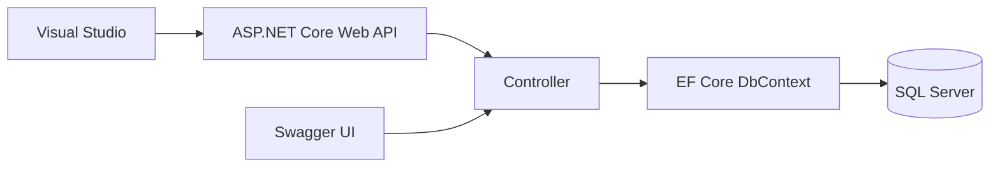
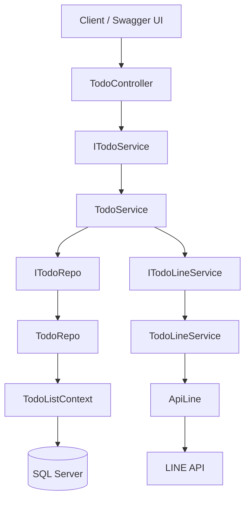

# คู่มือเริ่มต้นสร้างโปรเจกต์ TodoListAPI ด้วย Visual Studio

> คู่มือนี้อธิบายการสร้าง ASP.NET Core Web API, การติดตั้ง Entity Framework Core และ Swagger, การเชื่อมต่อ SQL Server แบบ Database First ด้วย `Scaffold-DbContext` ตลอดจนการ Build, Debug และ Run โปรเจกต์

---

## สารบัญ

1. [ภาพรวมระบบ](#1-ภาพรวมระบบ)
2. [สิ่งที่ต้องติดตั้งก่อนเริ่มต้น](#2-สิ่งที่ต้องติดตั้งก่อนเริ่มต้น)
3. [สร้างโปรเจกต์ TodoListAPI](#3-สร้างโปรเจกต์-todolistapi)
4. [ติดตั้ง NuGet Packages](#4-ติดตั้ง-nuget-packages)
5. [ติดตั้งและตั้งค่า Swagger](#5-ติดตั้งและตั้งค่า-swagger)
6. [ตั้งค่าการเชื่อมต่อ SQL Server](#6-ตั้งค่าการเชื่อมต่อ-sql-server)
7. [สร้าง Entity และ DbContext จากฐานข้อมูล](#7-สร้าง-entity-และ-dbcontext-จากฐานข้อมูล)
8. [ลงทะเบียน DbContext ใน Program.cs](#8-ลงทะเบียน-dbcontext-ใน-programcs)
9. [ทำความเข้าใจโครงสร้างโปรเจกต์แบบ MVC และ Layered Architecture](#9-ทำความเข้าใจโครงสร้างโปรเจกต์แบบ-mvc-และ-layered-architecture)
10. [สร้าง Controller ตัวอย่าง](#10-สร้าง-controller-ตัวอย่าง)
11. [Build, Debug และ Run](#11-build-debug-และ-run)
12. [ทดสอบ API ผ่าน Swagger UI](#12-ทดสอบ-api-ผ่าน-swagger-ui)
13. [ข้อผิดพลาดที่พบบ่อย](#13-ข้อผิดพลาดที่พบบ่อย)
14. [แนวทางความปลอดภัยและ Best Practices](#14-แนวทางความปลอดภัยและ-best-practices)


---

## 1. ภาพรวมระบบ

ตัวอย่างนี้ใช้แนวทาง **Database First** หมายถึงมีฐานข้อมูลและตารางใน SQL Server อยู่ก่อน แล้วใช้ EF Core สร้างคลาส Entity และ `DbContext` จากโครงสร้างฐานข้อมูล

ลำดับการทำงาน:



องค์ประกอบหลัก:

- **ASP.NET Core Web API** ใช้สร้าง REST API
- **Entity Framework Core** ใช้ติดต่อและจัดการข้อมูลใน SQL Server
- **SQL Server Provider** ทำให้ EF Core ทำงานกับ SQL Server ได้
- **Swagger/OpenAPI** ใช้แสดงเอกสารและทดลองเรียก API ผ่านเว็บเบราว์เซอร์

---

## 2. สิ่งที่ต้องติดตั้งก่อนเริ่มต้น

### 2.1 Visual Studio

ติดตั้ง Visual Studio 2022 และเลือก Workload:

```text
ASP.NET and web development
```

วิธีตรวจสอบหรือเพิ่ม Workload:

1. เปิด **Visual Studio Installer**
2. เลือก Visual Studio ที่ติดตั้งไว้
3. กด **Modify**
4. เลือก **ASP.NET and web development**
5. กด **Modify** เพื่อติดตั้ง

### 2.2 .NET SDK

ตรวจสอบเวอร์ชันผ่าน Terminal:

```bash
dotnet --version
```

ควรเลือก Target Framework ให้ตรงกับมาตรฐานของโครงการ เช่น `.NET 8.0` ซึ่งเป็นรุ่น LTS และต้องใช้ Package ของ EF Core major version เดียวกับ Target Framework ที่โครงการกำหนด

### 2.3 SQL Server

ต้องมีอย่างน้อยหนึ่งรายการต่อไปนี้:

- SQL Server Developer Edition
- SQL Server Express
- SQL Server LocalDB
- SQL Server ที่องค์กรจัดเตรียมไว้

แนะนำให้ติดตั้ง SQL Server Management Studio เพื่อสร้างตาราง ตรวจสอบข้อมูล และทดสอบ Connection

---

## 3. สร้างโปรเจกต์ TodoListAPI

1. เปิด Visual Studio
2. เลือก **Create a new project**
3. ค้นหาและเลือก **ASP.NET Core Web API**
4. กด **Next**
5. กำหนดค่า:
   - Project name: `TodoListAPI`
   - Solution name: `TodoListAPI`
   - Location: เลือกโฟลเดอร์เก็บ Source Code
6. กด **Next**
7. เลือก Framework ตามมาตรฐานโครงการ เช่น `.NET 8.0`
8. Authentication type: `None` สำหรับตัวอย่างเริ่มต้น
9. เลือก **Configure for HTTPS**
10. หากมีตัวเลือก **Use controllers** ให้เลือก เพื่อใช้งาน Controller แทน Minimal API
11. กด **Create**

> หาก Template สร้างไฟล์ WeatherForecast ตัวอย่างมาให้ สามารถเก็บไว้ทดสอบก่อน หรือลบออกภายหลังได้

### ตรวจสอบไฟล์โปรเจกต์

คลิกขวาที่ Project แล้วเลือก **Edit Project File** ตัวอย่างค่าพื้นฐาน:

```xml
<Project Sdk="Microsoft.NET.Sdk.Web">
  <PropertyGroup>
    <TargetFramework>net8.0</TargetFramework>
    <Nullable>enable</Nullable>
    <ImplicitUsings>enable</ImplicitUsings>
  </PropertyGroup>
</Project>
```

---

---

## 4. ติดตั้ง NuGet Packages

### 4.1 เปิด NuGet Package Manager

วิธีผ่านหน้าจอ:

1. คลิกขวาที่ Project `TodoListAPI`
2. เลือก **Manage NuGet Packages**
3. เลือกแท็บ **Browse**
4. ค้นหา Package
5. เลือก Version ที่ตรงกับ Target Framework และ EF Core packages ตัวอื่น
6. กด **Install** และยอมรับ License

Package ที่ต้องติดตั้ง:

| Package | หน้าที่ |
|---|---|
| `Microsoft.EntityFrameworkCore.SqlServer` | Provider สำหรับเชื่อมต่อ SQL Server |
| `Microsoft.EntityFrameworkCore.Tools` | คำสั่ง EF Core ใน Package Manager Console เช่น Scaffold และ Migration |
| `Microsoft.EntityFrameworkCore.Design` | Design-time services สำหรับ Scaffold และ Migration |
| `Swashbuckle.AspNetCore` | สร้าง OpenAPI document และ Swagger UI |

> Package กลุ่ม `Microsoft.EntityFrameworkCore.*` ควรใช้เวอร์ชันเดียวกันทั้งหมด และควรเข้ากันได้กับ Target Framework ของโปรเจกต์

### 4.2 ติดตั้งผ่าน Package Manager Console

ไปที่เมนู **Tools > NuGet Package Manager > Package Manager Console** แล้วตรวจสอบว่า `Default project` เป็น `TodoListAPI`

```powershell
Install-Package Microsoft.EntityFrameworkCore.SqlServer
Install-Package Microsoft.EntityFrameworkCore.Tools
Install-Package Microsoft.EntityFrameworkCore.Design
Install-Package Swashbuckle.AspNetCore
```

หากต้องการระบุเวอร์ชัน ให้เพิ่ม `-Version` ตามมาตรฐานโครงการ เช่น:

```powershell
Install-Package Microsoft.EntityFrameworkCore.SqlServer -Version 8.0.19
```

### 4.3 ตรวจสอบ Package ที่ติดตั้งแล้ว

ดูที่:

```text
Solution Explorer
└── Dependencies
    └── Packages
```

หรือใช้คำสั่ง:

```bash
dotnet list package
```

---

## 5. ติดตั้งและตั้งค่า Swagger

Swagger ช่วยให้ผู้พัฒนาเห็นรายการ Endpoint, Parameter, Request Body, Response และทดลองเรียก API ได้จาก Browser

### 5.1 เพิ่ม Swagger Services

เปิด `Program.cs` และเพิ่ม:

```csharp
builder.Services.AddEndpointsApiExplorer();
builder.Services.AddSwaggerGen();
```

- `AddEndpointsApiExplorer()` ทำให้ระบบค้นพบ Endpoint เพื่อสร้าง API description
- `AddSwaggerGen()` สร้างเอกสาร OpenAPI

### 5.2 เปิด Swagger Middleware และ Swagger UI

เพิ่มหลัง `var app = builder.Build();`

```csharp
if (app.Environment.IsDevelopment())
{
    app.UseSwagger();
    app.UseSwaggerUI();
}
```

Swagger จะแสดงเฉพาะ Development เพื่อไม่เปิดหน้าเอกสาร API ใน Production โดยไม่ตั้งใจ

### 5.3 ตัวอย่าง Program.cs ฉบับเริ่มต้น

```csharp
var builder = WebApplication.CreateBuilder(args);

builder.Services.AddControllers();

// Swagger/OpenAPI services
builder.Services.AddEndpointsApiExplorer();
builder.Services.AddSwaggerGen();

var app = builder.Build();

// Enable Swagger only in Development
if (app.Environment.IsDevelopment())
{
    app.UseSwagger();
    app.UseSwaggerUI();
}

app.UseHttpsRedirection();
app.UseAuthorization();
app.MapControllers();
app.Run();
```

### 5.4 เปิด Swagger อัตโนมัติเมื่อ Run

เปิด `Properties/launchSettings.json` และกำหนด:

```json
{
  "profiles": {
    "https": {
      "commandName": "Project",
      "dotnetRunMessages": true,
      "launchBrowser": true,
      "launchUrl": "swagger",
      "applicationUrl": "https://localhost:7001;http://localhost:5001",
      "environmentVariables": {
        "ASPNETCORE_ENVIRONMENT": "Development"
      }
    }
  }
}
```

Port จริงอาจต่างจากตัวอย่าง ให้ใช้งานค่าที่ Visual Studio สร้างไว้เดิมได้

---

## 6. ตั้งค่าการเชื่อมต่อ SQL Server

### 6.1 สร้างฐานข้อมูลตัวอย่าง

ตัวอย่าง SQL สำหรับสร้างฐานข้อมูลและตาราง:

```sql
CREATE DATABASE TodoListDB;
GO

USE TodoListDB;
GO

CREATE TABLE Todos
(
    Id          INT IDENTITY(1,1) PRIMARY KEY,
    Title       NVARCHAR(200) NOT NULL,
    Description NVARCHAR(1000) NULL,
    IsCompleted BIT NOT NULL DEFAULT 0,
    CreatedAt   DATETIME2 NOT NULL DEFAULT SYSDATETIME()
);
GO
```

### 6.2 เพิ่ม Connection String ใน appsettings.json

สำหรับ Windows Authentication:

```json
{
  "ConnectionStrings": {
    "DefaultConnection": "Server=YOUR_SERVER;Database=TodoListDB;Trusted_Connection=True;TrustServerCertificate=True;"
  },
  "Logging": {
    "LogLevel": {
      "Default": "Information",
      "Microsoft.AspNetCore": "Warning"
    }
  },
  "AllowedHosts": "*"
}
```

ตัวอย่างชื่อ Server:

```text
Server=localhost
Server=.\\SQLEXPRESS
Server=(localdb)\\MSSQLLocalDB
```

สำหรับ SQL Server Authentication:

```text
Server=YOUR_SERVER;Database=TodoListDB;User Id=YOUR_USER;Password=YOUR_PASSWORD;TrustServerCertificate=True;
```

> ห้าม Commit User/Password จริงลง Git ควรใช้ User Secrets, Environment Variables หรือ Secret Store ของระบบ Deployment

---

## 7. สร้าง Entity และ DbContext จากฐานข้อมูล

### 7.1 Database First คืออะไร

`Scaffold-DbContext` จะอ่าน Schema จาก SQL Server แล้วสร้าง:

- Entity class จากแต่ละ Table หรือ View
- Property จากแต่ละ Column
- Primary Key และ Relationship
- คลาส `DbContext` สำหรับ Query และบันทึกข้อมูล

### 7.2 รันคำสั่ง Scaffold ใน Package Manager Console

เปิด **Tools > NuGet Package Manager > Package Manager Console** และเลือก Default project เป็น `TodoListAPI`

คำสั่งแนะนำ:

```powershell
Scaffold-DbContext -f "Server=YOUR_SERVER;Database=DATABASENAME;Trusted_Connection=True" Microsoft.EntityFrameworkCore.SqlServer -OutputDir Entities\todoList
```

ความหมายของ Parameter:

| Parameter | ความหมาย |
|---|---|
| Connection String | ข้อมูล Server, Database และวิธี Authentication |
| `Microsoft.EntityFrameworkCore.SqlServer` | Provider ที่ EF Core ใช้เชื่อม SQL Server |
| `-OutputDir Models\Entities` | โฟลเดอร์ปลายทางของ Entity classes |
| `-Context TodoListDbContext` | กำหนดชื่อ DbContext |
| `-ContextDir Models\Entities` | โฟลเดอร์ปลายทางของ DbContext |
| `-NoOnConfiguring` | ไม่ฝัง Connection String ลงใน DbContext |
| `-Force` | เขียนทับไฟล์เดิมเมื่อ Scaffold ใหม่ |

> ใน Package Manager Console ใช้ `-Force` หรือชื่อย่อ `-f` ได้ แต่ `-Force` อ่านง่ายกว่า และควรวางไว้ท้ายคำสั่ง ไม่ใส่ก่อน Connection String

### 7.3 ตรวจสอบผลลัพธ์

ควรได้โครงสร้างคล้าย:

```text
Models/
└── Entities/
    ├── Todo.cs
    └── TodoListDbContext.cs
```

ตัวอย่าง Entity ที่สร้างขึ้น:

```csharp
public partial class Todo
{
    public int Id { get; set; }
    public string Title { get; set; } = null!;
    public string? Description { get; set; }
    public bool IsCompleted { get; set; }
    public DateTime CreatedAt { get; set; }
}
```

### 7.4 ข้อควรระวังเมื่อ Scaffold ใหม่

- `-f , -Force` จะเขียนทับไฟล์ที่ Scaffold เคยสร้าง
- ไม่ควรเขียน Business Logic ลงในไฟล์ Generated โดยตรง
- หากต้องเพิ่ม Logic ให้ใช้ `partial class`, Service หรือ DTO แยกไฟล์
- Commit หรือ Backup Source Code ก่อน Scaffold ใหม่ทุกครั้ง

---

## 8. ลงทะเบียน DbContext ใน Program.cs

เพิ่ม Namespaces ด้านบนของไฟล์:

```csharp
using Microsoft.EntityFrameworkCore;
using TodoListAPI.Models.Entities;
```

เพิ่ม Service ก่อน `builder.Build()`:

```csharp
builder.Services.AddDbContext<TodoListDbContext>(options =>
    options.UseSqlServer(
        builder.Configuration.GetConnectionString("DefaultConnection")));
```

ตัวอย่าง `Program.cs` ฉบับสมบูรณ์:

```csharp
using Microsoft.EntityFrameworkCore;
using TodoListAPI.Models.Entities;

var builder = WebApplication.CreateBuilder(args);

builder.Services.AddControllers();

builder.Services.AddDbContext<TodoListDbContext>(options =>
    options.UseSqlServer(
        builder.Configuration.GetConnectionString("DefaultConnection")));

builder.Services.AddEndpointsApiExplorer();
builder.Services.AddSwaggerGen();

var app = builder.Build();

if (app.Environment.IsDevelopment())
{
    app.UseSwagger();
    app.UseSwaggerUI();
}

app.UseHttpsRedirection();
app.UseAuthorization();
app.MapControllers();
app.Run();
```

---

## 9. ทำความเข้าใจโครงสร้างโปรเจกต์แบบ MVC และ Layered Architecture

โปรเจกต์ในภาพเป็น **ASP.NET Core Web API** ที่ประยุกต์แนวคิด MVC ร่วมกับ **Service Layer** และ **Repository Pattern** เพื่อแยกหน้าที่ของแต่ละส่วนให้ชัดเจน ดูแลรักษาง่าย และเหมาะกับการขยายระบบในอนาคต

> Web API จะใช้ส่วน **Controller** และ **Model** เป็นหลัก ส่วน **View** มักไม่มี เพราะ API ส่งข้อมูลกลับเป็น JSON ให้ Swagger, Web Application, Mobile Application หรือระบบอื่นนำไปใช้งาน

### 9.1 โครงสร้างโฟลเดอร์ตามภาพ

```text
TodoListAPI/
├── Controllers/
│   └── TodoController.cs
│
├── Entitie/
│   └── todoList/
│       ├── Todo.cs
│       ├── TodoListContext.cs
│       └── todoListContext.txt
│
├── Models/
│   ├── LineConfigSetting.cs
│   ├── LineSendMessageRequest.cs
│   └── SaveRequest.cs
│
├── Repository/
│   ├── Interface/
│   │   └── ITodoRepo.cs
│   └── TodoRepo.cs
│
├── Service/
│   ├── Interface/
│   │   ├── ITodoLineService.cs
│   │   └── ITodoService.cs
│   ├── ApiLine.cs
│   ├── TodoLineService.cs
│   └── TodoService.cs
│
├── Properties/
│   └── launchSettings.json
├── appsettings.json
├── appsettings.Development.json
├── Program.cs
└── TodoListAPI.csproj
```

### 9.2 ภาพรวมหน้าที่ของแต่ละ Layer



ลำดับการทำงานโดยทั่วไป:

1. Client หรือ Swagger UI ส่ง HTTP Request มาที่ `TodoController`
2. Controller ตรวจสอบข้อมูลเบื้องต้นและเรียก `ITodoService`
3. `TodoService` ประมวลผล Business Logic
4. หากต้องอ่านหรือบันทึกข้อมูล `TodoService` จะเรียก `ITodoRepo`
5. `TodoRepo` ใช้ `TodoListContext` ติดต่อ SQL Server
6. หากต้องส่ง LINE Message ระบบจะเรียก `ITodoLineService`
7. ผลลัพธ์จะถูกส่งย้อนกลับไปที่ Controller และตอบ Client เป็น JSON

---

### 9.3 โฟลเดอร์ Controllers

```text
Controllers/
└── TodoController.cs
```

`Controllers` เป็นจุดรับ HTTP Request จากผู้ใช้งานหรือระบบภายนอก เช่น Swagger UI, Angular, Mobile Application หรือ API Client

หน้าที่ของ `TodoController.cs`:

- กำหนด URL ของ API ด้วย `[Route]`
- กำหนด HTTP Method เช่น `[HttpGet]`, `[HttpPost]`, `[HttpPut]` และ `[HttpDelete]`
- รับ Parameter, Query String และ Request Body
- ตรวจสอบ Model Validation เบื้องต้น
- เรียกใช้งาน Service ผ่าน Interface
- ส่ง HTTP Status Code และ Response กลับไปยัง Client

ตัวอย่าง:

```csharp
using Microsoft.AspNetCore.Mvc;
using TodoListAPI.Service.Interface;

namespace TodoListAPI.Controllers;

[ApiController]
[Route("api/[controller]")]
public class TodoController : ControllerBase
{
    private readonly ITodoService _todoService;

    public TodoController(ITodoService todoService)
    {
        _todoService = todoService;
    }

    [HttpGet]
    public async Task<IActionResult> GetAll()
    {
        var result = await _todoService.GetAllAsync();
        return Ok(result);
    }
}
```

หลักการสำคัญคือ Controller ควรมีขนาดเล็ก และไม่ควรเขียน SQL หรือ Business Logic ที่ซับซ้อนภายใน Controller โดยตรง

---

### 9.4 โฟลเดอร์ Entitie

```text
Entitie/
└── todoList/
    ├── Todo.cs
    ├── TodoListContext.cs
    └── todoListContext.txt
```

โฟลเดอร์นี้เก็บคลาสที่เกี่ยวข้องกับโครงสร้างฐานข้อมูล ซึ่งโดยทั่วไปถูกสร้างจาก EF Core Scaffold หรือเขียนขึ้นเพื่อ Mapping กับ Table

#### Todo.cs

เป็น Entity Model ที่ Mapping กับตาราง `Todos` ใน SQL Server โดย Property ภายในคลาสจะสัมพันธ์กับ Column ของตาราง

```csharp
public partial class Todo
{
    public int Id { get; set; }
    public string Title { get; set; } = null!;
    public string? Description { get; set; }
    public bool IsCompleted { get; set; }
    public DateTime CreatedAt { get; set; }
}
```

#### TodoListContext.cs

เป็น EF Core `DbContext` ทำหน้าที่เป็นตัวกลางระหว่างโปรแกรมกับฐานข้อมูล เช่น:

- เปิดการเชื่อมต่อฐานข้อมูลตาม Configuration
- Mapping Entity กับ Table
- Query ข้อมูลผ่าน LINQ
- ติดตามการเปลี่ยนแปลงของ Entity
- บันทึกข้อมูลด้วย `SaveChangesAsync()`

```csharp
public partial class TodoListContext : DbContext
{
    public TodoListContext(DbContextOptions<TodoListContext> options)
        : base(options)
    {
    }

    public virtual DbSet<Todo> Todos { get; set; }
}
```

#### todoListContext.txt

จากภาพมีไฟล์ `todoListContext.txt` อยู่ร่วมกับ `TodoListContext.cs` ไฟล์ `.txt` ไม่ถูก Compile เป็น C# และอาจใช้เป็นไฟล์สำรอง ตัวอย่างคำสั่ง หรือบันทึกชั่วคราว

หากไฟล์ดังกล่าวไม่ถูกใช้งาน ควรลบออกจาก Project หรือย้ายไปไว้ในโฟลเดอร์เอกสาร เพื่อป้องกันความสับสน โดยเฉพาะหากภายในมี Connection String หรือข้อมูลสำคัญ


โครงสร้างที่แนะนำ:

```text
Entities/
└── TodoList/
    ├── Todo.cs
    └── TodoListContext.cs
```

---

### 9.5 โฟลเดอร์ Models

```text
Models/
├── LineConfigSetting.cs
├── LineSendMessageRequest.cs
└── SaveRequest.cs
```

`Models` ในโครงสร้างนี้ใช้เก็บ Model ที่ไม่ได้ Mapping กับ Table โดยตรง เช่น Configuration Model, Request DTO และ Response DTO

#### LineConfigSetting.cs

ใช้รับค่าการตั้งค่าของ LINE API จาก `appsettings.json` เช่น Base URL, Channel Access Token หรือ Endpoint

```csharp
public class LineConfigSetting
{
    public string BaseUrl { get; set; } = string.Empty;
    public string ChannelAccessToken { get; set; } = string.Empty;
}
```

#### LineSendMessageRequest.cs

ใช้เป็น Request Model สำหรับสร้างข้อมูลที่จะส่งไปยัง LINE API เช่น ผู้รับและข้อความ

```csharp
public class LineSendMessageRequest
{
    public string To { get; set; } = string.Empty;
    public string Message { get; set; } = string.Empty;
}
```

#### SaveRequest.cs

ใช้รับข้อมูลจาก Client สำหรับสร้างหรือแก้ไข Todo การแยก Request Model ออกจาก Entity ช่วยป้องกันไม่ให้ Client แก้ไข Field ที่ไม่ควรแก้ไข

```csharp
public class SaveRequest
{
    public string Title { get; set; } = string.Empty;
    public string? Description { get; set; }
    public bool IsCompleted { get; set; }
}
```

> หากโปรเจกต์มี Model จำนวนมาก แนะนำแยกเป็น `Models/Requests`, `Models/Responses` และ `Models/Configurations`

---

### 9.6 โฟลเดอร์ Repository

```text
Repository/
├── Interface/
│   └── ITodoRepo.cs
└── TodoRepo.cs
```

Repository Layer รับผิดชอบการเข้าถึงข้อมูลโดยตรง และซ่อนรายละเอียดของ EF Core จาก Service Layer

#### ITodoRepo.cs

เป็น Interface ที่กำหนด Contract ว่า Repository สามารถทำอะไรได้บ้าง โดยไม่กำหนดรายละเอียดการทำงาน

```csharp
public interface ITodoRepo
{
    Task<List<Todo>> GetAllAsync();
    Task<Todo?> GetByIdAsync(int id);
    Task<Todo> AddAsync(Todo todo);
    Task UpdateAsync(Todo todo);
    Task DeleteAsync(Todo todo);
}
```

#### TodoRepo.cs

เป็น Implementation ของ `ITodoRepo` และใช้ `TodoListContext` ติดต่อฐานข้อมูลจริง

```csharp
public class TodoRepo : ITodoRepo
{
    private readonly TodoListContext _context;

    public TodoRepo(TodoListContext context)
    {
        _context = context;
    }

    public async Task<List<Todo>> GetAllAsync()
    {
        return await _context.Todos
            .AsNoTracking()
            .ToListAsync();
    }
}
```

ประโยชน์ของ Repository:

- แยก Data Access Logic ออกจาก Business Logic
- ลดการเขียน Query ซ้ำหลายจุด
- เปลี่ยนหรือปรับวิธีเข้าถึงข้อมูลได้ง่ายขึ้น
- Mock Interface เพื่อเขียน Unit Test ได้

---

### 9.7 โฟลเดอร์ Service

```text
Service/
├── Interface/
│   ├── ITodoLineService.cs
│   └── ITodoService.cs
├── ApiLine.cs
├── TodoLineService.cs
└── TodoService.cs
```

Service Layer เป็นส่วนประมวลผล Business Logic และประสานงานระหว่าง Controller, Repository และ External API

#### ITodoService.cs

กำหนด Contract ของงานเกี่ยวกับ Todo ที่ Controller สามารถเรียกใช้ได้

```csharp
public interface ITodoService
{
    Task<IEnumerable<Todo>> GetAllAsync();
    Task<Todo?> GetByIdAsync(int id);
    Task<Todo> CreateAsync(SaveRequest request);
    Task<bool> UpdateAsync(int id, SaveRequest request);
    Task<bool> DeleteAsync(int id);
}
```

#### TodoService.cs

เป็น Implementation ของ `ITodoService` ทำหน้าที่:

- ตรวจสอบ Business Rule
- แปลง `SaveRequest` เป็น Entity
- เรียก Repository เพื่ออ่านหรือบันทึกข้อมูล
- เรียก LINE Service เมื่อจำเป็น
- จัดเตรียมผลลัพธ์ให้ Controller

ตัวอย่าง Business Flow:

```csharp
public async Task<Todo> CreateAsync(SaveRequest request)
{
    var todo = new Todo
    {
        Title = request.Title.Trim(),
        Description = request.Description,
        IsCompleted = request.IsCompleted,
        CreatedAt = DateTime.Now
    };

    var result = await _todoRepo.AddAsync(todo);
    await _todoLineService.SendTodoCreatedMessageAsync(result);

    return result;
}
```

#### ITodoLineService.cs

กำหนด Contract สำหรับงานส่งข้อความ Todo ไปยัง LINE โดยแยก Controller และ Todo Service ออกจากรายละเอียดของ LINE API

```csharp
public interface ITodoLineService
{
    Task SendTodoCreatedMessageAsync(Todo todo);
}
```

#### TodoLineService.cs

จัดเตรียมข้อความตาม Business Requirement แล้วเรียก Client ที่รับผิดชอบการสื่อสารกับ LINE API

หน้าที่ตัวอย่าง:

- กำหนดรูปแบบข้อความ
- ตรวจสอบว่าควรส่งข้อความหรือไม่
- สร้าง `LineSendMessageRequest`
- เรียก `ApiLine`
- จัดการผลลัพธ์หรือ Exception ในระดับ Service

#### ApiLine.cs

ทำหน้าที่เป็น HTTP Client Wrapper สำหรับสื่อสารกับ LINE API โดยตรง เช่น:

- สร้าง `HttpRequestMessage`
- กำหนด Authorization Header
- Serialize Request เป็น JSON
- เรียก `HttpClient.SendAsync()`
- ตรวจสอบ HTTP Status Code
- บันทึก Log เมื่อเรียก API ไม่สำเร็จ


---

### 9.8 ไฟล์หลักระดับ Project

โครงสร้างในภาพแสดงเฉพาะโฟลเดอร์หลักบางส่วน แต่โปรเจกต์ ASP.NET Core Web API ควรมีไฟล์ระดับ Root ต่อไปนี้ด้วย

#### Program.cs

เป็น Entry Point ของระบบ ใช้ลงทะเบียน Dependency Injection และกำหนด Middleware Pipeline

ตัวอย่างการลงทะเบียน Layer ต่าง ๆ:

```csharp
using Microsoft.EntityFrameworkCore;
using TodoListAPI.Entities.TodoList;
using TodoListAPI.Repository;
using TodoListAPI.Repository.Interface;
using TodoListAPI.Service;
using TodoListAPI.Service.Interface;

var builder = WebApplication.CreateBuilder(args);

builder.Services.AddControllers();
builder.Services.AddEndpointsApiExplorer();
builder.Services.AddSwaggerGen();

builder.Services.AddDbContext<TodoListContext>(options =>
    options.UseSqlServer(
        builder.Configuration.GetConnectionString("DefaultConnection")));

builder.Services.AddScoped<ITodoRepo, TodoRepo>();
builder.Services.AddScoped<ITodoService, TodoService>();
builder.Services.AddScoped<ITodoLineService, TodoLineService>();

builder.Services.AddHttpClient<ApiLine>();

var app = builder.Build();

if (app.Environment.IsDevelopment())
{
    app.UseSwagger();
    app.UseSwaggerUI();
}

app.UseHttpsRedirection();
app.UseAuthorization();
app.MapControllers();
app.Run();
```

#### appsettings.json

ใช้เก็บ Configuration เช่น Connection String, Logging และ LINE API Settings

```json
{
  "ConnectionStrings": {
    "DefaultConnection": "Server=YOUR_SERVER;Database=TodoListDB;Trusted_Connection=True;TrustServerCertificate=True;"
  },
  "LineConfig": {
    "BaseUrl": "https://api.example.com",
    "ChannelAccessToken": "DO_NOT_STORE_REAL_TOKEN_HERE"
  },
  "Logging": {
    "LogLevel": {
      "Default": "Information",
      "Microsoft.AspNetCore": "Warning"
    }
  },
  "AllowedHosts": "*"
}
```

ค่า Token จริงไม่ควรถูก Commit ลง Git ควรเก็บใน User Secrets, Environment Variables หรือ Secret Store

#### Properties/launchSettings.json

ใช้กำหนด URL, Port, Environment และหน้าเริ่มต้นเมื่อ Run จาก Visual Studio

#### TodoListAPI.csproj

ใช้กำหนด Target Framework และ NuGet Package References ของโปรเจกต์

---

### 9.9 ความเชื่อมโยงกับแนวคิด MVC

| MVC | ส่วนในโปรเจกต์ | หน้าที่ |
|---|---|---|
| Model | `Entities` และ `Models` | แทนข้อมูลจากฐานข้อมูล, Request, Response และ Configuration |
| View | ไม่มี View แบบ Razor | Web API ส่ง JSON และใช้ Swagger UI หรือ Frontend แสดงผล |
| Controller | `Controllers/TodoController.cs` | รับ Request, เรียก Service และส่ง Response |
| Business Layer | `Service` | ประมวลผลกฎทางธุรกิจและควบคุมลำดับการทำงาน |
| Data Access Layer | `Repository` และ `TodoListContext` | Query และบันทึกข้อมูลใน SQL Server |
| Integration Layer | `ApiLine` และ `TodoLineService` | เชื่อมต่อ LINE API หรือ External API |

ดังนั้นโครงสร้างในภาพไม่ใช่ MVC แบบสามโฟลเดอร์เท่านั้น แต่เป็น **MVC + Service Layer + Repository Pattern + External API Client** ซึ่งเหมาะกับ Web API ที่มี Business Logic และการเชื่อมต่อระบบภายนอก

---

### 9.10 Dependency Injection และอายุการใช้งานของ Object

การเชื่อมต่อแต่ละ Layer ควรทำผ่าน Dependency Injection แทนการใช้ `new` ภายใน Class

```csharp
builder.Services.AddScoped<ITodoRepo, TodoRepo>();
builder.Services.AddScoped<ITodoService, TodoService>();
builder.Services.AddScoped<ITodoLineService, TodoLineService>();
```

อายุการใช้งานที่ควรรู้:

- `AddTransient` สร้าง Object ใหม่ทุกครั้งที่ถูกเรียก
- `AddScoped` สร้างหนึ่ง Object ต่อหนึ่ง HTTP Request เหมาะกับ Service, Repository และ EF Core DbContext
- `AddSingleton` สร้าง Object เดียวตลอดอายุ Application ไม่ควรใช้กับ DbContext

Dependency ที่แนะนำ:

```text
TodoController
    -> ITodoService
        -> TodoService
            -> ITodoRepo
                -> TodoRepo
                    -> TodoListContext
            -> ITodoLineService
                -> TodoLineService
                    -> ApiLine / HttpClient
```

ไม่ควรสร้าง Dependency ย้อนกลับ เช่น Repository เรียก Controller หรือ Entity เรียก Service เพราะจะทำให้ Layer ผูกกันและทดสอบยาก

---

### 9.11 โครงสร้างที่แนะนำหลังปรับชื่อ

```text
TodoListAPI/
├── Controllers/
│   └── TodoController.cs
├── Entities/
│   └── TodoList/
│       ├── Todo.cs
│       └── TodoListContext.cs
├── Models/
│   ├── Configurations/
│   │   └── LineConfigSetting.cs
│   └── Requests/
│       ├── LineSendMessageRequest.cs
│       └── SaveTodoRequest.cs
├── Repositories/
│   ├── Interfaces/
│   │   └── ITodoRepository.cs
│   └── TodoRepository.cs
├── Services/
│   ├── Interfaces/
│   │   ├── ITodoLineService.cs
│   │   └── ITodoService.cs
│   ├── TodoLineService.cs
│   └── TodoService.cs
├── Integrations/
│   └── Line/
│       ├── ILineApiClient.cs
│       └── LineApiClient.cs
├── Properties/
│   └── launchSettings.json
├── appsettings.json
├── appsettings.Development.json
├── Program.cs
└── TodoListAPI.csproj
```

ชื่อที่ควรพิจารณาปรับ:

| ชื่อในภาพ | ชื่อที่แนะนำ | เหตุผล |
|---|---|---|
| `Entitie` | `Entities` | แก้คำสะกดและใช้รูปพหูพจน์ |
| `todoList` | `TodoList` | ใช้ PascalCase |
| `Repositoy` | `Repository` หรือ `Repositories` | แก้คำสะกด |
| `ITodoRepo` | `ITodoRepository` | ชื่อสื่อความหมายชัดเจน |
| `TodoRepo` | `TodoRepository` | ให้ตรงกับชื่อ Interface |
| `SaveRequest` | `SaveTodoRequest` | ระบุว่าเป็น Request ของข้อมูลใด |
| `ApiLine` | `LineApiClient` | สื่อว่าเป็น Client สำหรับเรียก External API |
| `todoListContext.txt` | ลบหรือย้ายไป `docs` | ไฟล์ข้อความไม่ถูก Compile และอาจทำให้สับสน |

### 9.12 หลักปฏิบัติสำหรับโครงสร้างโปรเจกต์

1. Controller รับผิดชอบเฉพาะ HTTP Request และ Response
2. Business Logic อยู่ใน Service
3. Database Query อยู่ใน Repository หรือ Data Access Layer
4. Entity ใช้แทนโครงสร้างฐานข้อมูล
5. Request และ Response ควรแยกจาก Entity
6. External API ควรมี Client หรือ Integration Layer แยกต่างหาก
7. ทุก Layer ควรอ้างอิงผ่าน Interface เมื่อจำเป็นต้อง Mock หรือสลับ Implementation
8. ใช้ Async สำหรับ Database และ HTTP I/O
9. ใช้ `ILogger<T>` เพื่อบันทึก Log แทน `Console.WriteLine`
10. ไม่เก็บ Password, Token หรือ Connection String ที่มีข้อมูลลับไว้ใน Source Code

---

## 10. สร้าง Controller ตัวอย่าง

สร้างไฟล์ `Controllers/TodosController.cs`:

```csharp
using Microsoft.AspNetCore.Mvc;
using Microsoft.EntityFrameworkCore;
using TodoListAPI.Models.Entities;

namespace TodoListAPI.Controllers;

[ApiController]
[Route("api/[controller]")]
public class TodosController : ControllerBase
{
    private readonly TodoListDbContext _context;

    public TodosController(TodoListDbContext context)
    {
        _context = context;
    }

    [HttpGet]
    public async Task<ActionResult<IEnumerable<Todo>>> GetTodos()
    {
        var todos = await _context.Todos
            .AsNoTracking()
            .OrderByDescending(x => x.CreatedAt)
            .ToListAsync();

        return Ok(todos);
    }

    [HttpGet("{id:int}")]
    public async Task<ActionResult<Todo>> GetTodo(int id)
    {
        var todo = await _context.Todos
            .AsNoTracking()
            .FirstOrDefaultAsync(x => x.Id == id);

        if (todo is null)
        {
            return NotFound();
        }

        return Ok(todo);
    }

    [HttpPost]
    public async Task<ActionResult<Todo>> CreateTodo(Todo todo)
    {
        todo.Id = 0;
        todo.CreatedAt = DateTime.Now;

        _context.Todos.Add(todo);
        await _context.SaveChangesAsync();

        return CreatedAtAction(nameof(GetTodo), new { id = todo.Id }, todo);
    }

    [HttpPut("{id:int}")]
    public async Task<IActionResult> UpdateTodo(int id, Todo request)
    {
        var todo = await _context.Todos.FindAsync(id);

        if (todo is null)
        {
            return NotFound();
        }

        todo.Title = request.Title;
        todo.Description = request.Description;
        todo.IsCompleted = request.IsCompleted;

        await _context.SaveChangesAsync();
        return NoContent();
    }

    [HttpDelete("{id:int}")]
    public async Task<IActionResult> DeleteTodo(int id)
    {
        var todo = await _context.Todos.FindAsync(id);

        if (todo is null)
        {
            return NotFound();
        }

        _context.Todos.Remove(todo);
        await _context.SaveChangesAsync();
        return NoContent();
    }
}
```

Endpoint ที่ได้:

| Method | URL | หน้าที่ |
|---|---|---|
| GET | `/api/Todos` | อ่านรายการทั้งหมด |
| GET | `/api/Todos/{id}` | อ่านข้อมูลตาม Id |
| POST | `/api/Todos` | เพิ่มข้อมูล |
| PUT | `/api/Todos/{id}` | แก้ไขข้อมูล |
| DELETE | `/api/Todos/{id}` | ลบข้อมูล |

> สำหรับ Production ควรแยก Request/Response DTO ออกจาก Entity เพื่อป้องกัน Over-posting และไม่ผูก API contract กับโครงสร้างฐานข้อมูลโดยตรง

---

## 11. Build, Debug และ Run

### 11.1 Build Solution

ใช้เมนู:

```text
Build > Build Solution
```

Keyboard shortcut:

```text
Ctrl + Shift + B
```

Build จะทำหน้าที่:

1. Restore Package ที่จำเป็น
2. Compile Source Code
3. ตรวจสอบ Syntax และ Type
4. สร้างไฟล์ Assembly ใน `bin/Debug/...`

ตรวจสอบ Error ที่หน้าต่าง:

```text
View > Error List
View > Output
```

หรือใช้ CLI:

```bash
dotnet restore
dotnet build
```

### 11.2 Run แบบ Debug

กด:

```text
F5
```

เหมาะสำหรับ:

- วาง Breakpoint
- ตรวจสอบค่าตัวแปร
- Step Into ด้วย `F11`
- Step Over ด้วย `F10`
- Continue ด้วย `F5`
- หยุดโปรแกรมด้วย `Shift + F5`

วิธีวาง Breakpoint:

1. เปิดไฟล์ Controller
2. คลิกขอบซ้ายของบรรทัดที่ต้องการหยุด
3. จุดวงกลมสีแดงจะปรากฏ
4. เรียก Endpoint จาก Swagger
5. Visual Studio จะหยุดที่บรรทัดดังกล่าว

เครื่องมือขณะ Debug:

- **Locals** ดูตัวแปรใน Scope ปัจจุบัน
- **Watch** ติดตาม Expression ที่กำหนด
- **Call Stack** ดูลำดับ Method ที่ถูกเรียก
- **Exception Settings** ตั้งให้หยุดเมื่อเกิด Exception

### 11.3 Run โดยไม่ Debug

กด:

```text
Ctrl + F5
```

เหมาะสำหรับทดสอบการทำงานทั่วไป และมักเริ่มได้เร็วกว่า Debug

### 11.4 Run ด้วย .NET CLI

เปิด Terminal ที่โฟลเดอร์โปรเจกต์:

```bash
dotnet run
```

Run และเฝ้าดูการเปลี่ยนแปลงไฟล์:

```bash
dotnet watch run
```

### 11.5 เลือก Startup Project

หาก Solution มีหลาย Project:

1. คลิกขวา `TodoListAPI`
2. เลือก **Set as Startup Project**
3. ตรวจสอบชื่อ Project ที่ปุ่ม Run ด้านบนของ Visual Studio

---

## 12. ทดสอบ API ผ่าน Swagger UI

เมื่อ Run สำเร็จ Browser ควรเปิด URL คล้าย:

```text
https://localhost:7001/swagger
```

ขั้นตอนทดลอง POST:

1. เปิด `POST /api/Todos`
2. กด **Try it out**
3. ใส่ Request Body:

```json
{
  "title": "เรียนรู้ ASP.NET Core Web API",
  "description": "สร้าง TodoListAPI และทดสอบผ่าน Swagger",
  "isCompleted": false
}
```

4. กด **Execute**
5. ตรวจสอบ Status Code และ Response Body
6. เรียก `GET /api/Todos` เพื่อตรวจสอบข้อมูลที่เพิ่ม

Status Code ที่ควรรู้:

| Status | ความหมาย |
|---|---|
| 200 OK | สำเร็จและมีข้อมูลตอบกลับ |
| 201 Created | สร้างข้อมูลสำเร็จ |
| 204 No Content | สำเร็จแต่ไม่มี Response Body |
| 400 Bad Request | Request ไม่ถูกต้อง |
| 404 Not Found | ไม่พบข้อมูลหรือ Endpoint |
| 500 Internal Server Error | เกิดข้อผิดพลาดภายในระบบ |

---

## 13. ข้อผิดพลาดที่พบบ่อย

### 13.1 ไม่รู้จัก AddSwaggerGen

อาการ:

```text
'IServiceCollection' does not contain a definition for 'AddSwaggerGen'
```

วิธีแก้:

1. ตรวจสอบว่าติดตั้ง `Swashbuckle.AspNetCore`
2. Restore และ Build ใหม่

```bash
dotnet restore
dotnet build
```

### 13.2 เปิด /swagger แล้วพบ 404

ตรวจสอบว่า:

- มี `app.UseSwagger()` และ `app.UseSwaggerUI()`
- Environment เป็น `Development`
- URL มี `/swagger`
- Run โปรไฟล์ที่ถูกต้องจาก `launchSettings.json`

### 13.3 Login failed for user

สาเหตุที่เป็นไปได้:

- Username หรือ Password ไม่ถูกต้อง
- SQL Server ยังไม่เปิด Mixed Mode Authentication
- Login ไม่มีสิทธิ์เข้าถึง Database
- ใช้ Windows Authentication แต่ Account ไม่มีสิทธิ์

### 13.4 A network-related or instance-specific error

ตรวจสอบ:

- ชื่อ Server และ Instance
- SQL Server Service ทำงานอยู่
- TCP/IP เปิดใช้งาน
- Firewall อนุญาต Port
- เครื่องผู้พัฒนาเชื่อมต่อ Network หรือ VPN ขององค์กรแล้ว

### 13.5 Certificate chain was issued by an authority that is not trusted

สำหรับ Development อาจใช้:

```text
TrustServerCertificate=True
```

สำหรับ Production ควรติดตั้งและตรวจสอบ Certificate ที่เชื่อถือได้ แทนการข้ามการตรวจสอบ

### 13.6 Scaffold-DbContext ไม่รู้จักคำสั่ง

ตรวจสอบ:

- ติดตั้ง `Microsoft.EntityFrameworkCore.Tools`
- Default project ใน Package Manager Console ถูกต้อง
- Package versions เข้ากันได้
- Build Project สำเร็จก่อน Scaffold

### 13.7 No database provider has been configured

ตรวจสอบว่าได้ลงทะเบียน DbContext ด้วย `AddDbContext` และ `UseSqlServer` ใน `Program.cs` แล้ว รวมถึงชื่อ Connection String ตรงกับ `appsettings.json`

### 13.8 Connection String เป็น null

ตรวจสอบชื่อ Key ให้ตรงกัน:

```csharp
builder.Configuration.GetConnectionString("DefaultConnection")
```

และ:

```json
"ConnectionStrings": {
  "DefaultConnection": "..."
}
```

---

## 14. แนวทางความปลอดภัยและ Best Practices

### 14.1 ใช้ User Secrets ในเครื่องผู้พัฒนา

เริ่มต้น User Secrets:

```bash
dotnet user-secrets init
```

บันทึก Connection String:

```bash
dotnet user-secrets set "ConnectionStrings:DefaultConnection" "Server=YOUR_SERVER;Database=TodoListDB;User Id=YOUR_USER;Password=YOUR_PASSWORD;TrustServerCertificate=True;"
```

### 14.2 ไม่เก็บข้อมูลลับใน Source Control

ไม่ควร Commit:

- Password
- Token
- API Key
- Production Connection String
- Certificate private key

### 14.3 แยก Configuration ตาม Environment

ตัวอย่าง:

```text
appsettings.json
appsettings.Development.json
appsettings.Production.json
```

### 14.4 แยก Layer เมื่อระบบใหญ่ขึ้น

โครงสร้างที่แนะนำ:

```text
Controllers  -> รับและตอบ HTTP
Services     -> Business Logic
Repositories -> Data Access หากโครงการเลือกใช้ Repository Pattern
DTOs         -> Request/Response Model
Entities     -> Database Model
```

### 14.5 ใช้ Async สำหรับงานฐานข้อมูล

ควรใช้:

```csharp
await _context.Todos.ToListAsync();
await _context.SaveChangesAsync();
```

เพื่อไม่ Block Thread ขณะรอ I/O

### 14.6 เปิด Swagger ใน Production อย่างระมัดระวัง

ค่าเริ่มต้นในคู่มือนี้เปิดเฉพาะ Development หากจำเป็นต้องเปิดใน Production ควรมีมาตรการ Authentication, Authorization หรือจำกัด Network Access

---


## เอกสารอ้างอิง

- ASP.NET Core Web API: https://learn.microsoft.com/aspnet/core/web-api/
- Swagger/OpenAPI ใน ASP.NET Core: https://learn.microsoft.com/aspnet/core/tutorials/web-api-help-pages-using-swagger
- EF Core SQL Server Provider: https://learn.microsoft.com/ef/core/providers/sql-server/
- Reverse Engineering ด้วย EF Core: https://learn.microsoft.com/ef/core/managing-schemas/scaffolding/
- Visual Studio Debugger: https://learn.microsoft.com/visualstudio/debugger/
- Safe storage of app secrets: https://learn.microsoft.com/aspnet/core/security/app-secrets

---

## สรุป

หลังทำครบทุกขั้นตอน โปรเจกต์ `TodoListAPI` จะสามารถเชื่อมต่อ SQL Server ผ่าน EF Core, สร้าง Entity จากฐานข้อมูลแบบ Database First, ให้บริการ CRUD API ผ่าน Controller และทดสอบ Endpoint ได้ผ่าน Swagger UI โดย Visual Studio รองรับทั้ง Build, Run และ Debug เพื่อวิเคราะห์การทำงานทีละบรรทัด
