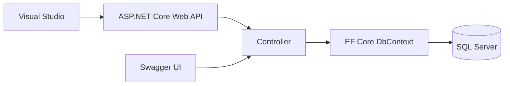

# คู่มือเริ่มต้นสร้างโปรเจกต์ TodoListAPI ด้วย Visual Studio

> คู่มือนี้อธิบายการสร้าง ASP.NET Core Web API, การติดตั้ง Entity Framework Core และ Swagger, การเชื่อมต่อ SQL Server แบบ Database First ด้วย `Scaffold-DbContext` ตลอดจนการ Build, Debug และ Run โปรเจกต์

---

## สารบัญ

1. [ภาพรวมระบบ](#1-ภาพรวมระบบ)
2. [สิ่งที่ต้องติดตั้งก่อนเริ่มต้น](#2-สิ่งที่ต้องติดตั้งก่อนเริ่มต้น)
3. [สร้างโปรเจกต์ TodoListAPI](#3-สร้างโปรเจกต์-todolistapi)
4. [ทำความเข้าใจโครงสร้างโปรเจกต์](#4-ทำความเข้าใจโครงสร้างโปรเจกต์)
5. [ติดตั้ง NuGet Packages](#5-ติดตั้ง-nuget-packages)
6. [ติดตั้งและตั้งค่า Swagger](#6-ติดตั้งและตั้งค่า-swagger)
7. [ตั้งค่าการเชื่อมต่อ SQL Server](#7-ตั้งค่าการเชื่อมต่อ-sql-server)
8. [สร้าง Entity และ DbContext จากฐานข้อมูล](#8-สร้าง-entity-และ-dbcontext-จากฐานข้อมูล)
9. [ลงทะเบียน DbContext ใน Program.cs](#9-ลงทะเบียน-dbcontext-ใน-programcs)
10. [สร้าง Controller ตัวอย่าง](#10-สร้าง-controller-ตัวอย่าง)
11. [Build, Debug และ Run](#11-build-debug-และ-run)
12. [ทดสอบ API ผ่าน Swagger UI](#12-ทดสอบ-api-ผ่าน-swagger-ui)
13. [ข้อผิดพลาดที่พบบ่อย](#13-ข้อผิดพลาดที่พบบ่อย)
14. [แนวทางความปลอดภัยและ Best Practices](#14-แนวทางความปลอดภัยและ-best-practices)
15. [Checklist](#15-checklist)

---

## 1. ภาพรวมระบบ

ตัวอย่างนี้ใช้แนวทาง **Database First** หมายถึงมีฐานข้อมูลและตารางใน SQL Server อยู่ก่อน แล้วใช้ EF Core สร้างคลาส Entity และ `DbContext` จากโครงสร้างฐานข้อมูล

ลำดับการทำงาน:



องค์ประกอบหลัก:

- **ASP.NET Core Web API** ใช้สร้าง REST API
- **Entity Framework Core** ใช้ติดต่อและจัดการข้อมูลใน SQL Server
- **SQL Server Provider** ทำให้ EF Core ทำงานกับ SQL Server ได้
- **Swagger/OpenAPI** ใช้แสดงเอกสารและทดลองเรียก API ผ่านเว็บเบราว์เซอร์

---

## 2. สิ่งที่ต้องติดตั้งก่อนเริ่มต้น

### 2.1 Visual Studio

ติดตั้ง Visual Studio 2022 และเลือก Workload:

```text
ASP.NET and web development
```

วิธีตรวจสอบหรือเพิ่ม Workload:

1. เปิด **Visual Studio Installer**
2. เลือก Visual Studio ที่ติดตั้งไว้
3. กด **Modify**
4. เลือก **ASP.NET and web development**
5. กด **Modify** เพื่อติดตั้ง

### 2.2 .NET SDK

ตรวจสอบเวอร์ชันผ่าน Terminal:

```bash
dotnet --version
```

ควรเลือก Target Framework ให้ตรงกับมาตรฐานของโครงการ เช่น `.NET 8.0` ซึ่งเป็นรุ่น LTS และต้องใช้ Package ของ EF Core major version เดียวกับ Target Framework ที่โครงการกำหนด

### 2.3 SQL Server

ต้องมีอย่างน้อยหนึ่งรายการต่อไปนี้:

- SQL Server Developer Edition
- SQL Server Express
- SQL Server LocalDB
- SQL Server ที่องค์กรจัดเตรียมไว้

แนะนำให้ติดตั้ง SQL Server Management Studio เพื่อสร้างตาราง ตรวจสอบข้อมูล และทดสอบ Connection

---

## 3. สร้างโปรเจกต์ TodoListAPI

1. เปิด Visual Studio
2. เลือก **Create a new project**
3. ค้นหาและเลือก **ASP.NET Core Web API**
4. กด **Next**
5. กำหนดค่า:
   - Project name: `TodoListAPI`
   - Solution name: `TodoListAPI`
   - Location: เลือกโฟลเดอร์เก็บ Source Code
6. กด **Next**
7. เลือก Framework ตามมาตรฐานโครงการ เช่น `.NET 8.0`
8. Authentication type: `None` สำหรับตัวอย่างเริ่มต้น
9. เลือก **Configure for HTTPS**
10. หากมีตัวเลือก **Use controllers** ให้เลือก เพื่อใช้งาน Controller แทน Minimal API
11. กด **Create**

> หาก Template สร้างไฟล์ WeatherForecast ตัวอย่างมาให้ สามารถเก็บไว้ทดสอบก่อน หรือลบออกภายหลังได้

### ตรวจสอบไฟล์โปรเจกต์

คลิกขวาที่ Project แล้วเลือก **Edit Project File** ตัวอย่างค่าพื้นฐาน:

```xml
<Project Sdk="Microsoft.NET.Sdk.Web">
  <PropertyGroup>
    <TargetFramework>net8.0</TargetFramework>
    <Nullable>enable</Nullable>
    <ImplicitUsings>enable</ImplicitUsings>
  </PropertyGroup>
</Project>
```

---

## 4. ทำความเข้าใจโครงสร้างโปรเจกต์

```text
TodoListAPI/
├── Controllers/              # API Controllers
├── Models/
│   └── Entities/             # Entity และ DbContext ที่ Scaffold
├── Properties/
│   └── launchSettings.json   # URL และ Environment ตอน Run
├── appsettings.json          # Configuration หลัก
├── appsettings.Development.json
├── Program.cs                # Register Services และ Middleware
└── TodoListAPI.csproj        # Framework และ Package References
```

หน้าที่สำคัญ:

- `Program.cs` เป็นจุดเริ่มต้นของแอปพลิเคชัน
- `appsettings.json` เก็บ Configuration เช่น Connection String
- `Controllers` รับ HTTP Request และส่ง HTTP Response
- `Models/Entities` เก็บคลาสที่ Mapping กับตารางฐานข้อมูล

---

## 5. ติดตั้ง NuGet Packages

### 5.1 เปิด NuGet Package Manager

วิธีผ่านหน้าจอ:

1. คลิกขวาที่ Project `TodoListAPI`
2. เลือก **Manage NuGet Packages**
3. เลือกแท็บ **Browse**
4. ค้นหา Package
5. เลือก Version ที่ตรงกับ Target Framework และ EF Core packages ตัวอื่น
6. กด **Install** และยอมรับ License

Package ที่ต้องติดตั้ง:

| Package | หน้าที่ |
|---|---|
| `Microsoft.EntityFrameworkCore.SqlServer` | Provider สำหรับเชื่อมต่อ SQL Server |
| `Microsoft.EntityFrameworkCore.Tools` | คำสั่ง EF Core ใน Package Manager Console เช่น Scaffold และ Migration |
| `Microsoft.EntityFrameworkCore.Design` | Design-time services สำหรับ Scaffold และ Migration |
| `Swashbuckle.AspNetCore` | สร้าง OpenAPI document และ Swagger UI |

> Package กลุ่ม `Microsoft.EntityFrameworkCore.*` ควรใช้เวอร์ชันเดียวกันทั้งหมด และควรเข้ากันได้กับ Target Framework ของโปรเจกต์

### 5.2 ติดตั้งผ่าน Package Manager Console

ไปที่เมนู **Tools > NuGet Package Manager > Package Manager Console** แล้วตรวจสอบว่า `Default project` เป็น `TodoListAPI`

```powershell
Install-Package Microsoft.EntityFrameworkCore.SqlServer
Install-Package Microsoft.EntityFrameworkCore.Tools
Install-Package Microsoft.EntityFrameworkCore.Design
Install-Package Swashbuckle.AspNetCore
```

หากต้องการระบุเวอร์ชัน ให้เพิ่ม `-Version` ตามมาตรฐานโครงการ เช่น:

```powershell
Install-Package Microsoft.EntityFrameworkCore.SqlServer -Version 8.0.19
```

### 5.3 ตรวจสอบ Package ที่ติดตั้งแล้ว

ดูที่:

```text
Solution Explorer
└── Dependencies
    └── Packages
```

หรือใช้คำสั่ง:

```bash
dotnet list package
```

---

## 6. ติดตั้งและตั้งค่า Swagger

Swagger ช่วยให้ผู้พัฒนาเห็นรายการ Endpoint, Parameter, Request Body, Response และทดลองเรียก API ได้จาก Browser

### 6.1 เพิ่ม Swagger Services

เปิด `Program.cs` และเพิ่ม:

```csharp
builder.Services.AddEndpointsApiExplorer();
builder.Services.AddSwaggerGen();
```

- `AddEndpointsApiExplorer()` ทำให้ระบบค้นพบ Endpoint เพื่อสร้าง API description
- `AddSwaggerGen()` สร้างเอกสาร OpenAPI

### 6.2 เปิด Swagger Middleware และ Swagger UI

เพิ่มหลัง `var app = builder.Build();`

```csharp
if (app.Environment.IsDevelopment())
{
    app.UseSwagger();
    app.UseSwaggerUI();
}
```

Swagger จะแสดงเฉพาะ Development เพื่อไม่เปิดหน้าเอกสาร API ใน Production โดยไม่ตั้งใจ

### 6.3 ตัวอย่าง Program.cs ฉบับเริ่มต้น

```csharp
var builder = WebApplication.CreateBuilder(args);

builder.Services.AddControllers();

// Swagger/OpenAPI services
builder.Services.AddEndpointsApiExplorer();
builder.Services.AddSwaggerGen();

var app = builder.Build();

// Enable Swagger only in Development
if (app.Environment.IsDevelopment())
{
    app.UseSwagger();
    app.UseSwaggerUI();
}

app.UseHttpsRedirection();
app.UseAuthorization();
app.MapControllers();
app.Run();
```

### 6.4 เปิด Swagger อัตโนมัติเมื่อ Run

เปิด `Properties/launchSettings.json` และกำหนด:

```json
{
  "profiles": {
    "https": {
      "commandName": "Project",
      "dotnetRunMessages": true,
      "launchBrowser": true,
      "launchUrl": "swagger",
      "applicationUrl": "https://localhost:7001;http://localhost:5001",
      "environmentVariables": {
        "ASPNETCORE_ENVIRONMENT": "Development"
      }
    }
  }
}
```

Port จริงอาจต่างจากตัวอย่าง ให้ใช้งานค่าที่ Visual Studio สร้างไว้เดิมได้

---

## 7. ตั้งค่าการเชื่อมต่อ SQL Server

### 7.1 สร้างฐานข้อมูลตัวอย่าง

ตัวอย่าง SQL สำหรับสร้างฐานข้อมูลและตาราง:

```sql
CREATE DATABASE TodoListDB;
GO

USE TodoListDB;
GO

CREATE TABLE Todos
(
    Id          INT IDENTITY(1,1) PRIMARY KEY,
    Title       NVARCHAR(200) NOT NULL,
    Description NVARCHAR(1000) NULL,
    IsCompleted BIT NOT NULL DEFAULT 0,
    CreatedAt   DATETIME2 NOT NULL DEFAULT SYSDATETIME()
);
GO
```

### 7.2 เพิ่ม Connection String ใน appsettings.json

สำหรับ Windows Authentication:

```json
{
  "ConnectionStrings": {
    "DefaultConnection": "Server=YOUR_SERVER;Database=TodoListDB;Trusted_Connection=True;TrustServerCertificate=True;"
  },
  "Logging": {
    "LogLevel": {
      "Default": "Information",
      "Microsoft.AspNetCore": "Warning"
    }
  },
  "AllowedHosts": "*"
}
```

ตัวอย่างชื่อ Server:

```text
Server=localhost
Server=.\\SQLEXPRESS
Server=(localdb)\\MSSQLLocalDB
```

สำหรับ SQL Server Authentication:

```text
Server=YOUR_SERVER;Database=TodoListDB;User Id=YOUR_USER;Password=YOUR_PASSWORD;TrustServerCertificate=True;
```

> ห้าม Commit User/Password จริงลง Git ควรใช้ User Secrets, Environment Variables หรือ Secret Store ของระบบ Deployment

---

## 8. สร้าง Entity และ DbContext จากฐานข้อมูล

### 8.1 Database First คืออะไร

`Scaffold-DbContext` จะอ่าน Schema จาก SQL Server แล้วสร้าง:

- Entity class จากแต่ละ Table หรือ View
- Property จากแต่ละ Column
- Primary Key และ Relationship
- คลาส `DbContext` สำหรับ Query และบันทึกข้อมูล

### 8.2 รันคำสั่ง Scaffold ใน Package Manager Console

เปิด **Tools > NuGet Package Manager > Package Manager Console** และเลือก Default project เป็น `TodoListAPI`

คำสั่งแนะนำ:

```powershell
Scaffold-DbContext "Server=YOUR_SERVER;Database=TodoListDB;Trusted_Connection=True;TrustServerCertificate=True;" Microsoft.EntityFrameworkCore.SqlServer -OutputDir Models\Entities -Context TodoListDbContext -ContextDir Models\Entities -NoOnConfiguring -Force
```

ความหมายของ Parameter:

| Parameter | ความหมาย |
|---|---|
| Connection String | ข้อมูล Server, Database และวิธี Authentication |
| `Microsoft.EntityFrameworkCore.SqlServer` | Provider ที่ EF Core ใช้เชื่อม SQL Server |
| `-OutputDir Models\Entities` | โฟลเดอร์ปลายทางของ Entity classes |
| `-Context TodoListDbContext` | กำหนดชื่อ DbContext |
| `-ContextDir Models\Entities` | โฟลเดอร์ปลายทางของ DbContext |
| `-NoOnConfiguring` | ไม่ฝัง Connection String ลงใน DbContext |
| `-Force` | เขียนทับไฟล์เดิมเมื่อ Scaffold ใหม่ |

> ใน Package Manager Console ใช้ `-Force` หรือชื่อย่อ `-f` ได้ แต่ `-Force` อ่านง่ายกว่า และควรวางไว้ท้ายคำสั่ง ไม่ใส่ก่อน Connection String

### 8.3 Scaffold เฉพาะบางตาราง

```powershell
Scaffold-DbContext "Server=YOUR_SERVER;Database=TodoListDB;Trusted_Connection=True;TrustServerCertificate=True;" Microsoft.EntityFrameworkCore.SqlServer -OutputDir Models\Entities -Context TodoListDbContext -NoOnConfiguring -Tables Todos -Force
```

หลายตาราง:

```powershell
-Tables Todos,TodoCategories,Users
```

### 8.4 ตรวจสอบผลลัพธ์

ควรได้โครงสร้างคล้าย:

```text
Models/
└── Entities/
    ├── Todo.cs
    └── TodoListDbContext.cs
```

ตัวอย่าง Entity ที่สร้างขึ้น:

```csharp
public partial class Todo
{
    public int Id { get; set; }
    public string Title { get; set; } = null!;
    public string? Description { get; set; }
    public bool IsCompleted { get; set; }
    public DateTime CreatedAt { get; set; }
}
```

### 8.5 ข้อควรระวังเมื่อ Scaffold ใหม่

- `-Force` จะเขียนทับไฟล์ที่ Scaffold เคยสร้าง
- ไม่ควรเขียน Business Logic ลงในไฟล์ Generated โดยตรง
- หากต้องเพิ่ม Logic ให้ใช้ `partial class`, Service หรือ DTO แยกไฟล์
- Commit หรือ Backup Source Code ก่อน Scaffold ใหม่ทุกครั้ง

---

## 9. ลงทะเบียน DbContext ใน Program.cs

เพิ่ม Namespaces ด้านบนของไฟล์:

```csharp
using Microsoft.EntityFrameworkCore;
using TodoListAPI.Models.Entities;
```

เพิ่ม Service ก่อน `builder.Build()`:

```csharp
builder.Services.AddDbContext<TodoListDbContext>(options =>
    options.UseSqlServer(
        builder.Configuration.GetConnectionString("DefaultConnection")));
```

ตัวอย่าง `Program.cs` ฉบับสมบูรณ์:

```csharp
using Microsoft.EntityFrameworkCore;
using TodoListAPI.Models.Entities;

var builder = WebApplication.CreateBuilder(args);

builder.Services.AddControllers();

builder.Services.AddDbContext<TodoListDbContext>(options =>
    options.UseSqlServer(
        builder.Configuration.GetConnectionString("DefaultConnection")));

builder.Services.AddEndpointsApiExplorer();
builder.Services.AddSwaggerGen();

var app = builder.Build();

if (app.Environment.IsDevelopment())
{
    app.UseSwagger();
    app.UseSwaggerUI();
}

app.UseHttpsRedirection();
app.UseAuthorization();
app.MapControllers();
app.Run();
```

---

## 10. สร้าง Controller ตัวอย่าง

สร้างไฟล์ `Controllers/TodosController.cs`:

```csharp
using Microsoft.AspNetCore.Mvc;
using Microsoft.EntityFrameworkCore;
using TodoListAPI.Models.Entities;

namespace TodoListAPI.Controllers;

[ApiController]
[Route("api/[controller]")]
public class TodosController : ControllerBase
{
    private readonly TodoListDbContext _context;

    public TodosController(TodoListDbContext context)
    {
        _context = context;
    }

    [HttpGet]
    public async Task<ActionResult<IEnumerable<Todo>>> GetTodos()
    {
        var todos = await _context.Todos
            .AsNoTracking()
            .OrderByDescending(x => x.CreatedAt)
            .ToListAsync();

        return Ok(todos);
    }

    [HttpGet("{id:int}")]
    public async Task<ActionResult<Todo>> GetTodo(int id)
    {
        var todo = await _context.Todos
            .AsNoTracking()
            .FirstOrDefaultAsync(x => x.Id == id);

        if (todo is null)
        {
            return NotFound();
        }

        return Ok(todo);
    }

    [HttpPost]
    public async Task<ActionResult<Todo>> CreateTodo(Todo todo)
    {
        todo.Id = 0;
        todo.CreatedAt = DateTime.Now;

        _context.Todos.Add(todo);
        await _context.SaveChangesAsync();

        return CreatedAtAction(nameof(GetTodo), new { id = todo.Id }, todo);
    }

    [HttpPut("{id:int}")]
    public async Task<IActionResult> UpdateTodo(int id, Todo request)
    {
        var todo = await _context.Todos.FindAsync(id);

        if (todo is null)
        {
            return NotFound();
        }

        todo.Title = request.Title;
        todo.Description = request.Description;
        todo.IsCompleted = request.IsCompleted;

        await _context.SaveChangesAsync();
        return NoContent();
    }

    [HttpDelete("{id:int}")]
    public async Task<IActionResult> DeleteTodo(int id)
    {
        var todo = await _context.Todos.FindAsync(id);

        if (todo is null)
        {
            return NotFound();
        }

        _context.Todos.Remove(todo);
        await _context.SaveChangesAsync();
        return NoContent();
    }
}
```

Endpoint ที่ได้:

| Method | URL | หน้าที่ |
|---|---|---|
| GET | `/api/Todos` | อ่านรายการทั้งหมด |
| GET | `/api/Todos/{id}` | อ่านข้อมูลตาม Id |
| POST | `/api/Todos` | เพิ่มข้อมูล |
| PUT | `/api/Todos/{id}` | แก้ไขข้อมูล |
| DELETE | `/api/Todos/{id}` | ลบข้อมูล |

> สำหรับ Production ควรแยก Request/Response DTO ออกจาก Entity เพื่อป้องกัน Over-posting และไม่ผูก API contract กับโครงสร้างฐานข้อมูลโดยตรง

---

## 11. Build, Debug และ Run

### 11.1 Build Solution

ใช้เมนู:

```text
Build > Build Solution
```

Keyboard shortcut:

```text
Ctrl + Shift + B
```

Build จะทำหน้าที่:

1. Restore Package ที่จำเป็น
2. Compile Source Code
3. ตรวจสอบ Syntax และ Type
4. สร้างไฟล์ Assembly ใน `bin/Debug/...`

ตรวจสอบ Error ที่หน้าต่าง:

```text
View > Error List
View > Output
```

หรือใช้ CLI:

```bash
dotnet restore
dotnet build
```

### 11.2 Run แบบ Debug

กด:

```text
F5
```

เหมาะสำหรับ:

- วาง Breakpoint
- ตรวจสอบค่าตัวแปร
- Step Into ด้วย `F11`
- Step Over ด้วย `F10`
- Continue ด้วย `F5`
- หยุดโปรแกรมด้วย `Shift + F5`

วิธีวาง Breakpoint:

1. เปิดไฟล์ Controller
2. คลิกขอบซ้ายของบรรทัดที่ต้องการหยุด
3. จุดวงกลมสีแดงจะปรากฏ
4. เรียก Endpoint จาก Swagger
5. Visual Studio จะหยุดที่บรรทัดดังกล่าว

เครื่องมือขณะ Debug:

- **Locals** ดูตัวแปรใน Scope ปัจจุบัน
- **Watch** ติดตาม Expression ที่กำหนด
- **Call Stack** ดูลำดับ Method ที่ถูกเรียก
- **Exception Settings** ตั้งให้หยุดเมื่อเกิด Exception

### 11.3 Run โดยไม่ Debug

กด:

```text
Ctrl + F5
```

เหมาะสำหรับทดสอบการทำงานทั่วไป และมักเริ่มได้เร็วกว่า Debug

### 11.4 Run ด้วย .NET CLI

เปิด Terminal ที่โฟลเดอร์โปรเจกต์:

```bash
dotnet run
```

Run และเฝ้าดูการเปลี่ยนแปลงไฟล์:

```bash
dotnet watch run
```

### 11.5 เลือก Startup Project

หาก Solution มีหลาย Project:

1. คลิกขวา `TodoListAPI`
2. เลือก **Set as Startup Project**
3. ตรวจสอบชื่อ Project ที่ปุ่ม Run ด้านบนของ Visual Studio

---

## 12. ทดสอบ API ผ่าน Swagger UI

เมื่อ Run สำเร็จ Browser ควรเปิด URL คล้าย:

```text
https://localhost:7001/swagger
```

ขั้นตอนทดลอง POST:

1. เปิด `POST /api/Todos`
2. กด **Try it out**
3. ใส่ Request Body:

```json
{
  "title": "เรียนรู้ ASP.NET Core Web API",
  "description": "สร้าง TodoListAPI และทดสอบผ่าน Swagger",
  "isCompleted": false
}
```

4. กด **Execute**
5. ตรวจสอบ Status Code และ Response Body
6. เรียก `GET /api/Todos` เพื่อตรวจสอบข้อมูลที่เพิ่ม

Status Code ที่ควรรู้:

| Status | ความหมาย |
|---|---|
| 200 OK | สำเร็จและมีข้อมูลตอบกลับ |
| 201 Created | สร้างข้อมูลสำเร็จ |
| 204 No Content | สำเร็จแต่ไม่มี Response Body |
| 400 Bad Request | Request ไม่ถูกต้อง |
| 404 Not Found | ไม่พบข้อมูลหรือ Endpoint |
| 500 Internal Server Error | เกิดข้อผิดพลาดภายในระบบ |

---

## 13. ข้อผิดพลาดที่พบบ่อย

### 13.1 ไม่รู้จัก AddSwaggerGen

อาการ:

```text
'IServiceCollection' does not contain a definition for 'AddSwaggerGen'
```

วิธีแก้:

1. ตรวจสอบว่าติดตั้ง `Swashbuckle.AspNetCore`
2. Restore และ Build ใหม่

```bash
dotnet restore
dotnet build
```

### 13.2 เปิด /swagger แล้วพบ 404

ตรวจสอบว่า:

- มี `app.UseSwagger()` และ `app.UseSwaggerUI()`
- Environment เป็น `Development`
- URL มี `/swagger`
- Run โปรไฟล์ที่ถูกต้องจาก `launchSettings.json`

### 13.3 Login failed for user

สาเหตุที่เป็นไปได้:

- Username หรือ Password ไม่ถูกต้อง
- SQL Server ยังไม่เปิด Mixed Mode Authentication
- Login ไม่มีสิทธิ์เข้าถึง Database
- ใช้ Windows Authentication แต่ Account ไม่มีสิทธิ์

### 13.4 A network-related or instance-specific error

ตรวจสอบ:

- ชื่อ Server และ Instance
- SQL Server Service ทำงานอยู่
- TCP/IP เปิดใช้งาน
- Firewall อนุญาต Port
- เครื่องผู้พัฒนาเชื่อมต่อ Network หรือ VPN ขององค์กรแล้ว

### 13.5 Certificate chain was issued by an authority that is not trusted

สำหรับ Development อาจใช้:

```text
TrustServerCertificate=True
```

สำหรับ Production ควรติดตั้งและตรวจสอบ Certificate ที่เชื่อถือได้ แทนการข้ามการตรวจสอบ

### 13.6 Scaffold-DbContext ไม่รู้จักคำสั่ง

ตรวจสอบ:

- ติดตั้ง `Microsoft.EntityFrameworkCore.Tools`
- Default project ใน Package Manager Console ถูกต้อง
- Package versions เข้ากันได้
- Build Project สำเร็จก่อน Scaffold

### 13.7 No database provider has been configured

ตรวจสอบว่าได้ลงทะเบียน DbContext ด้วย `AddDbContext` และ `UseSqlServer` ใน `Program.cs` แล้ว รวมถึงชื่อ Connection String ตรงกับ `appsettings.json`

### 13.8 Connection String เป็น null

ตรวจสอบชื่อ Key ให้ตรงกัน:

```csharp
builder.Configuration.GetConnectionString("DefaultConnection")
```

และ:

```json
"ConnectionStrings": {
  "DefaultConnection": "..."
}
```

---

## 14. แนวทางความปลอดภัยและ Best Practices

### 14.1 ใช้ User Secrets ในเครื่องผู้พัฒนา

เริ่มต้น User Secrets:

```bash
dotnet user-secrets init
```

บันทึก Connection String:

```bash
dotnet user-secrets set "ConnectionStrings:DefaultConnection" "Server=YOUR_SERVER;Database=TodoListDB;User Id=YOUR_USER;Password=YOUR_PASSWORD;TrustServerCertificate=True;"
```

### 14.2 ไม่เก็บข้อมูลลับใน Source Control

ไม่ควร Commit:

- Password
- Token
- API Key
- Production Connection String
- Certificate private key

### 14.3 แยก Configuration ตาม Environment

ตัวอย่าง:

```text
appsettings.json
appsettings.Development.json
appsettings.Production.json
```

### 14.4 แยก Layer เมื่อระบบใหญ่ขึ้น

โครงสร้างที่แนะนำ:

```text
Controllers  -> รับและตอบ HTTP
Services     -> Business Logic
Repositories -> Data Access หากโครงการเลือกใช้ Repository Pattern
DTOs         -> Request/Response Model
Entities     -> Database Model
```

### 14.5 ใช้ Async สำหรับงานฐานข้อมูล

ควรใช้:

```csharp
await _context.Todos.ToListAsync();
await _context.SaveChangesAsync();
```

เพื่อไม่ Block Thread ขณะรอ I/O

### 14.6 เปิด Swagger ใน Production อย่างระมัดระวัง

ค่าเริ่มต้นในคู่มือนี้เปิดเฉพาะ Development หากจำเป็นต้องเปิดใน Production ควรมีมาตรการ Authentication, Authorization หรือจำกัด Network Access

---

## 15. Checklist

- [ ] ติดตั้ง Visual Studio และ ASP.NET and web development workload
- [ ] ตรวจสอบ .NET SDK
- [ ] สร้าง ASP.NET Core Web API ชื่อ `TodoListAPI`
- [ ] เปิดใช้ Controllers และ HTTPS
- [ ] ติดตั้ง EF Core SQL Server, Tools และ Design
- [ ] ติดตั้ง Swashbuckle.AspNetCore
- [ ] เพิ่ม Swagger Services และ Middleware
- [ ] สร้างฐานข้อมูลและตาราง `Todos`
- [ ] เพิ่ม `DefaultConnection`
- [ ] รัน `Scaffold-DbContext`
- [ ] ตรวจสอบ Entity และ DbContext
- [ ] ลงทะเบียน DbContext ใน `Program.cs`
- [ ] สร้าง `TodosController`
- [ ] Build Solution โดยไม่มี Error
- [ ] Run และเปิด `/swagger`
- [ ] ทดสอบ CRUD ผ่าน Swagger UI
- [ ] ย้ายข้อมูลลับไป User Secrets หรือ Secret Store

---

## เอกสารอ้างอิง

- ASP.NET Core Web API: https://learn.microsoft.com/aspnet/core/web-api/
- Swagger/OpenAPI ใน ASP.NET Core: https://learn.microsoft.com/aspnet/core/tutorials/web-api-help-pages-using-swagger
- EF Core SQL Server Provider: https://learn.microsoft.com/ef/core/providers/sql-server/
- Reverse Engineering ด้วย EF Core: https://learn.microsoft.com/ef/core/managing-schemas/scaffolding/
- Visual Studio Debugger: https://learn.microsoft.com/visualstudio/debugger/
- Safe storage of app secrets: https://learn.microsoft.com/aspnet/core/security/app-secrets

---

## สรุป

หลังทำครบทุกขั้นตอน โปรเจกต์ `TodoListAPI` จะสามารถเชื่อมต่อ SQL Server ผ่าน EF Core, สร้าง Entity จากฐานข้อมูลแบบ Database First, ให้บริการ CRUD API ผ่าน Controller และทดสอบ Endpoint ได้ผ่าน Swagger UI โดย Visual Studio รองรับทั้ง Build, Run และ Debug เพื่อวิเคราะห์การทำงานทีละบรรทัด
